# CostPilot Documentation

**Enterprise Cloud Cost Optimization Platform**

---

## Welcome

This is the comprehensive documentation for CostPilot, an enterprise-grade cloud cost optimization platform that helps organizations track, analyze, and optimize their cloud spending across AWS, Azure, and Google Cloud Platform.

---

## Quick Links

| I Want To... | Go To |
|--------------|-------|
| Get started quickly | [Quick Start Guide](quickstart.md) |
| Install CostPilot | [Installation Guide](installation.md) |
| Connect cloud accounts | [Add Cloud Accounts](guides/add-cloud-account.md) |
| Understand costs | [Dashboard](dashboard.md), [Expenses](expenses.md) |
| Optimize spending | [Recommendations](recommendations.md) |
| Invite team members | [Invite Users](guides/invite-users.md) |
| Set up budgets | [Create Budget Pools](guides/create-budget-pools.md) |
| Export reports | [Export Data](guides/export-data.md) |
| Fix problems | [Troubleshooting](troubleshooting.md) |

---

## Documentation Structure

### 🚀 Getting Started

- **[Overview](overview.md)** - What is CostPilot and key capabilities
- **[Quick Start Guide](quickstart.md)** - Get up and running in 5 minutes
- **[Installation Guide](installation.md)** - Deploy CostPilot with Docker Compose
- **[Architecture](architecture.md)** - System architecture and tech stack

### 💰 Cost Management

- **[Dashboard](dashboard.md)** - Central cost overview and insights
- **[Expense Tracking](expenses.md)** - Cost explorer with detailed breakdowns
- **[Cloud Accounts](cloud-accounts.md)** - Connect and manage AWS, Azure, GCP accounts
- **[Resource Discovery](resources.md)** - Discover and track all cloud resources

### 🎯 Optimization

- **[Recommendations](recommendations.md)** - AI-powered cost optimization suggestions
- **[Recommendation Rules](recommendation-rules.md)** - Create custom optimization rules
- **[Rules Engine](rules-engine.md)** - Automated resource-to-pool assignment rules

### 📊 Organization & Budget Management

- **[Pool Hierarchy](pools.md)** - Budget pools and organizational structure
- **[User Management](users.md)** - Invite and manage team members
- **[Organizations](organizations.md)** - Multi-tenant organization setup

### 🔐 Security & Access Control

- **[Authentication](authentication.md)** - Login, registration, and session management
- **[RBAC & ABAC](rbac.md)** - Advanced role-based and attribute-based access control
- **[Audit Logging](audit-logging.md)** - Security event tracking and compliance

### ⚙️ Automation & Operations

- **[Schedulers](schedulers.md)** - Automated data collection and processing
- **[Notifications](notifications.md)** - Email alerts and preferences
- **[Data Export](exports.md)** - Export and download cost data

### 📖 How-To Guides

- **[How to Add Cloud Accounts](guides/add-cloud-account.md)** - Step-by-step for AWS, Azure, GCP
- **[How to Configure Recommendation Rules](guides/configure-recommendation-rules.md)** - Create custom rules
- **[How to Invite Users](guides/invite-users.md)** - Add team members
- **[How to Create Budget Pools](guides/create-budget-pools.md)** - Set up cost allocation
- **[How to Export Data](guides/export-data.md)** - Download reports
- **[How to Set Up Schedulers](guides/setup-schedulers.md)** - Automate data collection *(coming soon)*
- **[How to Configure Notifications](guides/configure-notifications.md)** - Set up alerts *(coming soon)*
- **[How to Manage User Roles](guides/manage-user-roles.md)** - Configure permissions *(coming soon)*

### 🔧 Reference

- **[API Reference](api-reference.md)** - Complete REST API documentation *(coming soon)*
- **[Environment Variables](environment-variables.md)** - Configuration reference
- **[Database Schema](database-schema.md)** - Data model documentation *(coming soon)*
- **[Troubleshooting](troubleshooting.md)** - Common issues and solutions
- **[Security Best Practices](security-best-practices.md)** - Security hardening guide *(coming soon)*

---

## Feature Coverage

### ✅ Fully Implemented & Documented

- Multi-cloud cost tracking (AWS, Azure, GCP)
- Dashboard with cost overview
- Expense tracking with breakdowns
- Resource discovery
- Recommendations engine
- Custom recommendation rules
- Pool-based budget hierarchy
- User management and invitations
- Advanced RBAC with ABAC
- SSO integration (SAML/OIDC)
- Notifications system
- Data collection schedulers
- Data export (CSV, JSON, Parquet, PDF, Excel)
- Audit logging
- Session security and token blacklisting
- Rate limiting and input validation
- Feature flags

### 🚧 Enterprise Stubs (Planned & Documented in Backlog)

- E01: Chargeback/Showback
- E02: Allocation Engine
- E03: Audit Logging / Regulatory Reports
- E04: Approval Workflow
- E05: Spend Forecasting
- E06: Commitment Tracker
- E08: FX/Tax Conversion
- E09: Anomaly Detection
- E10: FinOps Maturity Assessment
- E11: Collaboration Notes
- E12: Enterprise Connectors
- E14: Platform Health Dashboard

---

## Screenshots

This documentation includes screenshots of all major features captured from a live instance:

- 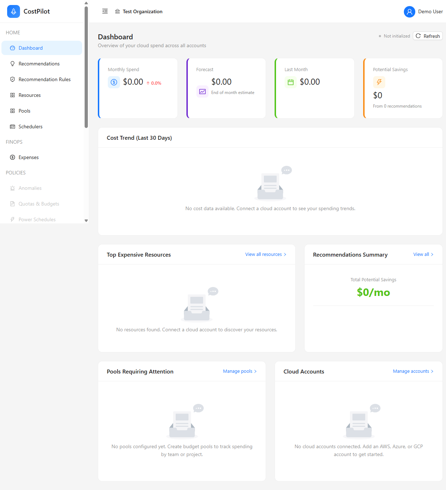
- 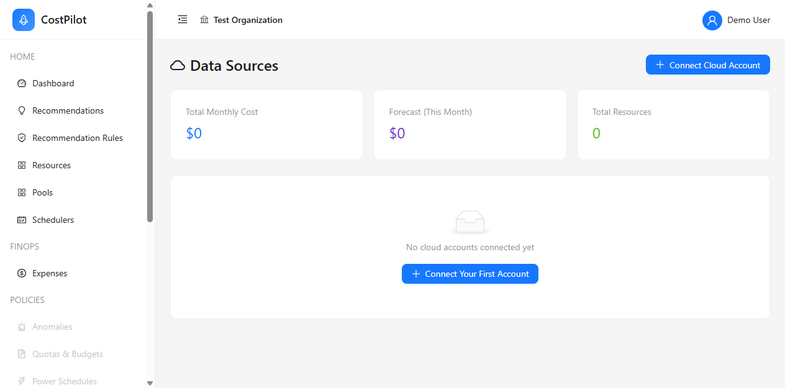
- 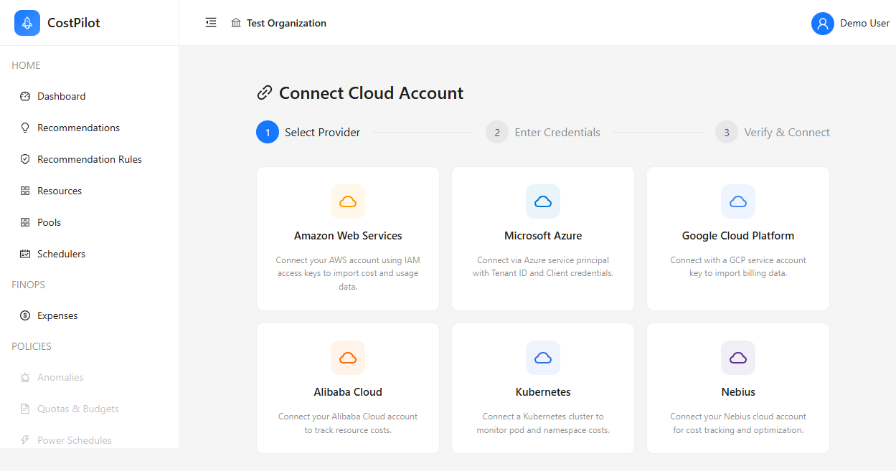
- 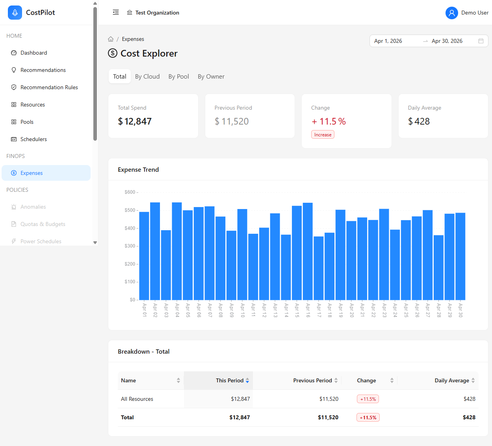
- 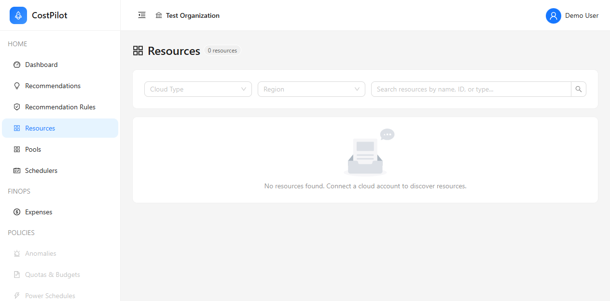
- 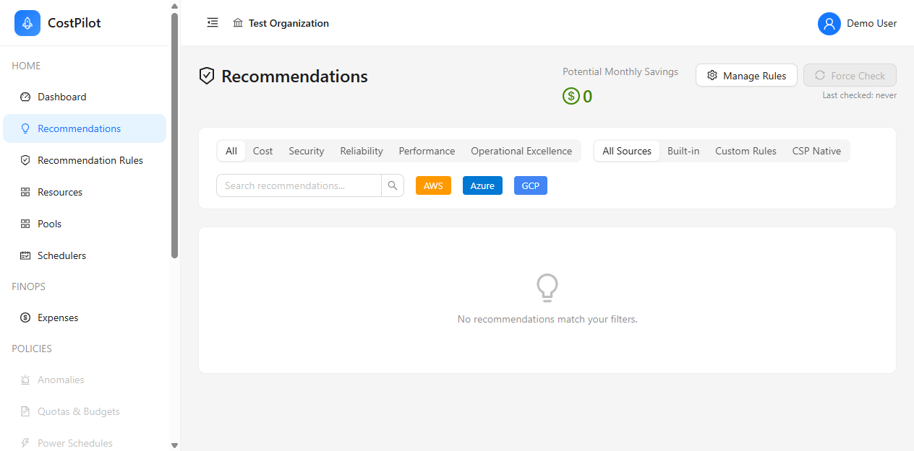
- 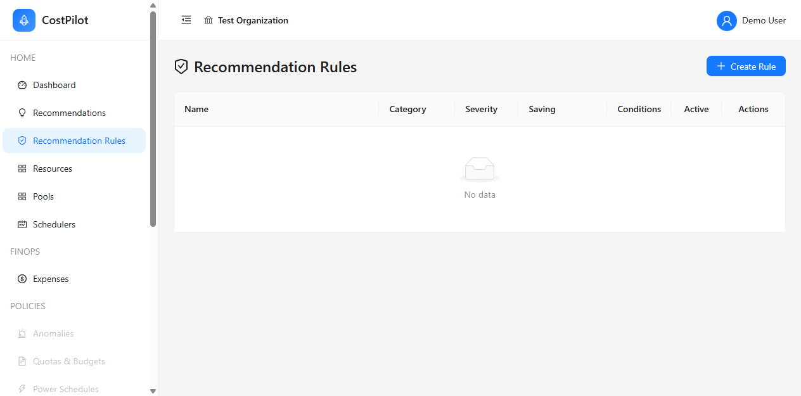
- 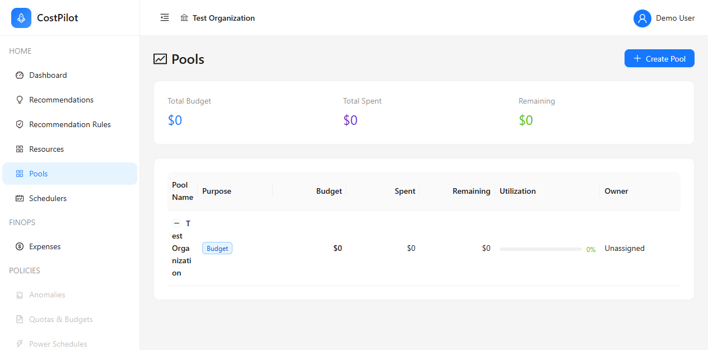
- 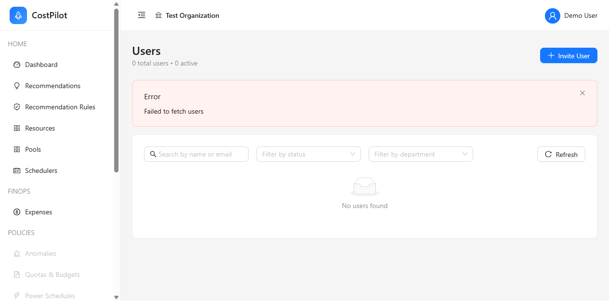
- 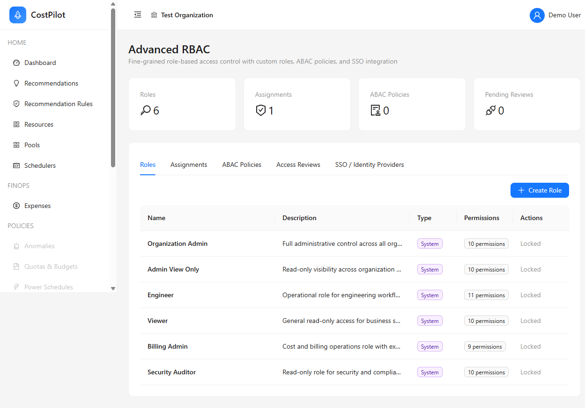
- 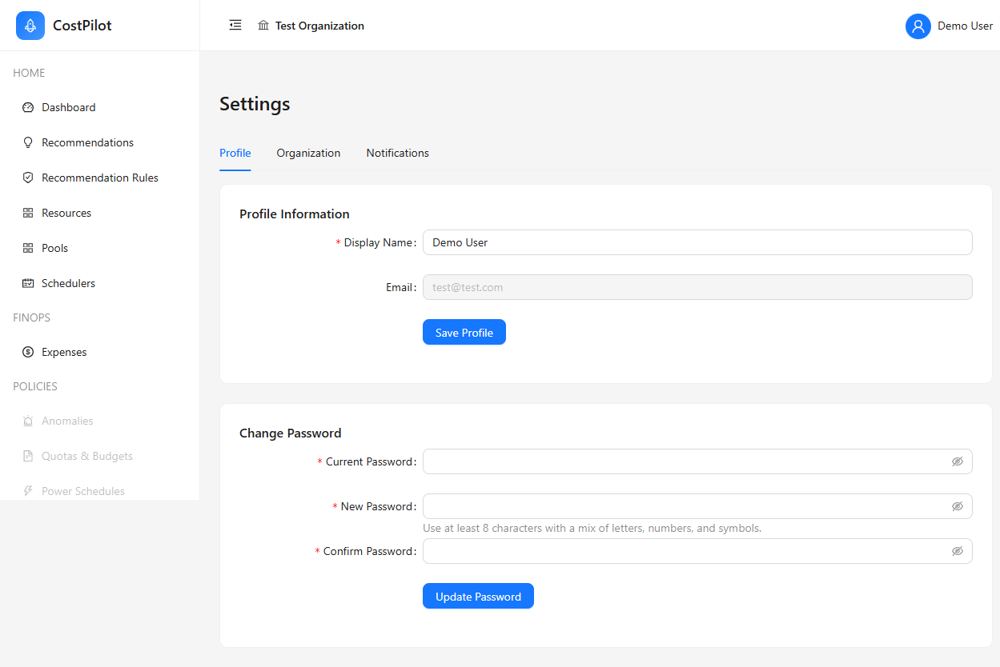
- 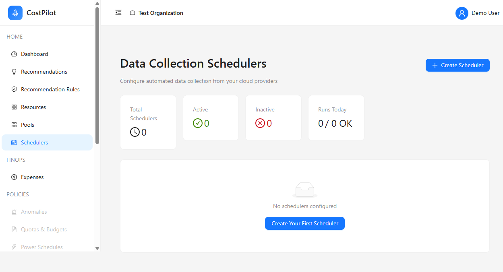
- 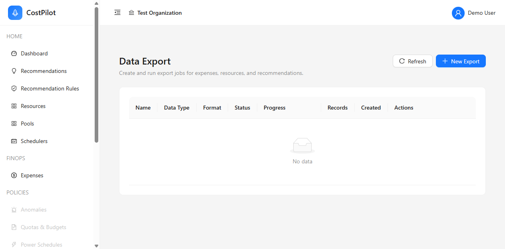

All screenshots are stored in the `screenshots/` folder.

---

## Contributing to Documentation

This documentation is written in Markdown. To contribute:

1. Edit the relevant `.md` file
2. Follow the existing style and structure
3. Add screenshots where appropriate
4. Submit a pull request

**Style Guide:**
- Use ATX-style headers (`#`, `##`, `###`)
- Use code blocks for commands and JSON
- Use tables for structured data
- Include screenshots for UI features
- Link to related documentation

---

## Documentation Status

- **Version:** 1.0.0
- **Last Updated:** April 9, 2026
- **Total Pages:** 30+
- **How-To Guides:** 8 (6 complete, 2 coming soon)
- **Screenshots:** 13

---

## Need Help?

- **[Troubleshooting Guide](troubleshooting.md)** - Common issues and solutions
- **[Security Audit Report](../AUDIT.md)** - Security findings
- **[Feature Backlog](../BACKLOG.md)** - Enterprise feature roadmap
- **[GitHub Issues](https://github.com/your-org/costpilot/issues)** - Report bugs or request features

---

## License

Proprietary - All rights reserved

---

**© 2026 CostPilot. All rights reserved.**
