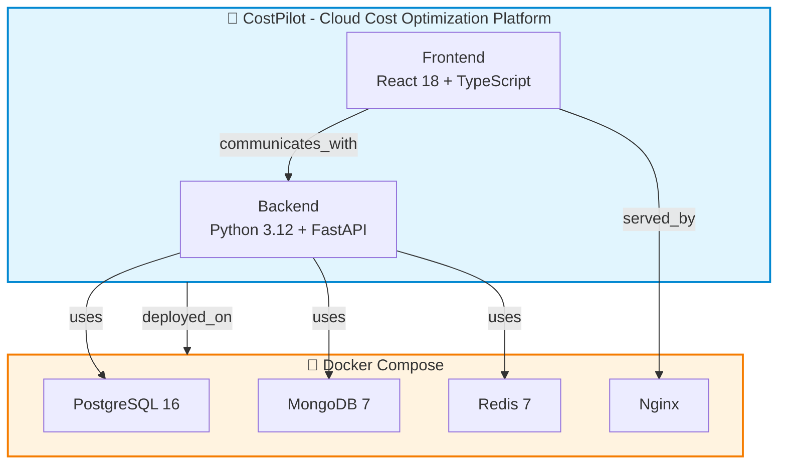
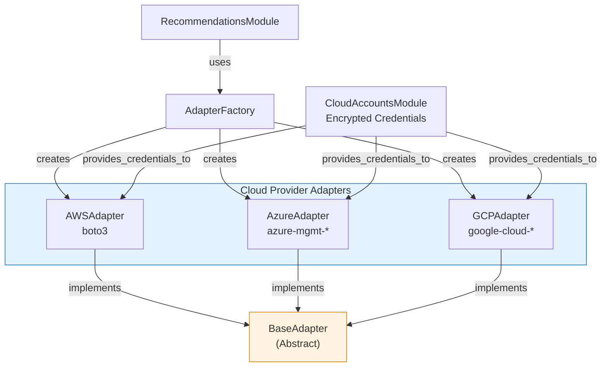
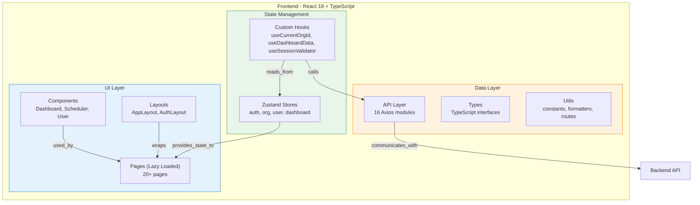
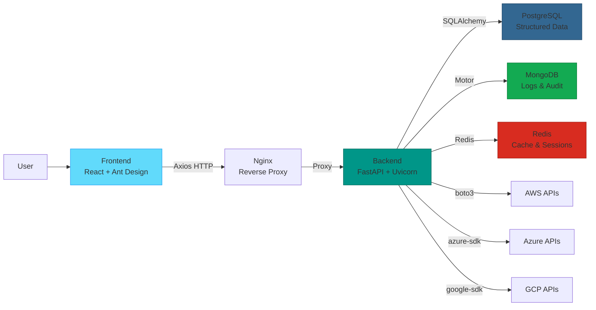

# CostPilot Knowledge Graph

> Open this file in VS Code with the "Markdown Preview Mermaid Support" extension to see the diagrams rendered.

## High-Level Architecture

## Backend Modules

```mermaid
graph TB
    BE["Backend<br/>FastAPI Application"]

    subgraph Core["Core Modules"]
        AUTH["AuthModule<br/>JWT, Sessions, Rate Limiting"]
        ORG["OrganizationsModule<br/>Multi-tenant Orgs"]
        CA["CloudAccountsModule<br/>AWS/Azure/GCP Accounts"]
        UM["UserManagementModule<br/>Invitations, Activity Log"]
    end

    subgraph CloudFeatures["Cloud Features"]
        EXP["ExpensesModule<br/>Cost Tracking"]
        RES["ResourcesModule<br/>Resource Discovery"]
        REC["RecommendationsModule<br/>Cost Optimization"]
        POOL["PoolsModule<br/>Resource Pools"]
        RULE["RulesModule<br/>Optimization Rules"]
        RR["RecommendationRulesModule<br/>Rec Rules"]
    end

    subgraph Enterprise["Enterprise Features"]
        ENT["EnterpriseModule<br/>RBAC, ABAC, SSO, Exports"]
        SEC["SecurityModule<br/>Audit Logs, Alerts"]
        NOTIF["NotificationsModule<br/>Email: SMTP/SES/SendGrid"]
    end

    subgraph Platform["Platform Infrastructure"]
        MW["MiddlewareModule<br/>Rate Limit, Validation, Timeout"]
        MET["MetricsModule<br/>Prometheus"]
        HC["HealthModule<br/>Health Checks"]
        SHARED["SharedModule<br/>Circuit Breaker, Retry, Encryption"]
        CACHE["CostCacheModule<br/>Cost Caching"]
        IDEMP["IdempotencyModule<br/>Deduplication"]
        SCHED["SchedulerModule<br/>APScheduler Tasks"]
        DASH["DashboardsModule<br/>Widget Dashboards"]
    end

    subgraph Databases["Databases"]
        PG["PostgreSQL"]
        MG["MongoDB"]
        RD["Redis"]
    end

    BE --> AUTH & ORG & CA & UM
    BE --> EXP & RES & REC & POOL & RULE & RR
    BE --> ENT & SEC & NOTIF
    BE --> MW & MET & HC & SHARED & CACHE & IDEMP & SCHED & DASH

    AUTH -->|uses| PG & RD
    CA -->|encrypted credentials| PG
    EXP -->|depends_on| CA
    RES -->|depends_on| CA
    REC -->|depends_on| CA
    POOL -->|scoped_to| ORG
    RULE -->|applies_to| POOL
    RR -->|configures| REC
    ENT -->|extends| AUTH
    UM -->|belongs_to| ORG
    NOTIF -->|sends_emails_for| UM
    MW -->|uses| RD
    CACHE -->|uses| RD
    SCHED -->|uses| PG & MG
    SEC -->|uses| MG
    SHARED -->|provides_base_for| AUTH & ORG & CA & POOL & RULE & DASH
    DASH -->|visualizes| EXP & RES & REC

    style Core fill:#e8f5e9,stroke:#388e3c
    style CloudFeatures fill:#e3f2fd,stroke:#1976d2
    style Enterprise fill:#fce4ec,stroke:#c62828
    style Platform fill:#f3e5f5,stroke:#7b1fa2
    style Databases fill:#fff8e1,stroke:#f9a825
```

## Recommendations Adapter Pattern

## Frontend Architecture

## Data Flow

## Entity Summary

| Entity Type | Count | Examples |
|---|---|---|
| Project | 1 | CostPilot |
| Application | 2 | Backend, Frontend |
| Infrastructure | 1 | Docker Compose |
| BackendModule | 20 | Auth, Organizations, CloudAccounts, Expenses, Resources, Recommendations, Pools, Rules, Scheduler, Dashboards, Notifications, UserManagement, Enterprise, Security, Middleware, Metrics, Health, Shared, Idempotency, CostCache |
| FrontendModule | 8 | ApiLayer, Pages, Components, Store, Hooks, Layouts, Types, Utils |
| Component | 5 | AWSAdapter, AzureAdapter, GCPAdapter, AdapterFactory, BaseAdapter |
| Database | 3 | PostgreSQL, MongoDB, Redis |
| TestSuite | 1 | BackendTests (30+ test files) |
| Documentation | 1 | Plans |
| **Total** | **42** | |

## Relation Summary

| Relation Type | Count | Description |
|---|---|---|
| contains | 30 | Parent contains child module |
| uses | 12 | Module uses database/service |
| depends_on | 3 | Module depends on another |
| implements | 3 | Adapter implements interface |
| creates | 3 | Factory creates adapter |
| provides_credentials_to | 3 | CloudAccounts feeds adapters |
| provides_base_for | 6 | SharedModule provides base classes |
| visualizes | 3 | Dashboard visualizes data |
| communicates_with | 1 | Frontend talks to Backend |
| Other | 18 | scoped_to, extends, wraps, etc. |
| **Total** | **82** | |
