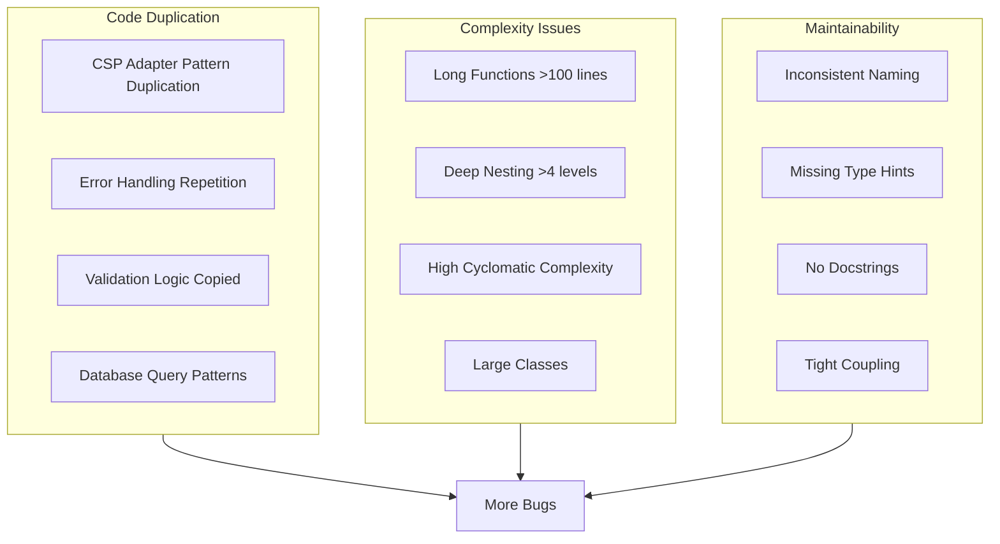

# CostPilot Clean Code Enhancement Plan

## Executive Summary

This plan addresses code quality improvements to reduce bugs, eliminate duplication, improve maintainability, and establish consistent coding standards across the CostPilot codebase.

---

## 1. CODE QUALITY ANALYSIS

### 1.1 Current Code Quality Issues



### 1.2 Duplication Analysis

| Location | Duplication Type | Lines Duplicated | Impact |
|----------|-----------------|------------------|--------|
| CSP Adapters | Error handling patterns | ~200 lines across 3 files | High maintenance |
| Service Layer | DB session management | ~150 lines across services | Inconsistent behavior |
| API Clients | HTTP retry logic | ~100 lines | Security risk |
| Validation | Input sanitization | ~80 lines | Inconsistent validation |

---

## 2. CODE DEDUPLICATION STRATEGY

### 2.1 CSP Adapter Base Classes

```python
# app/cloud_accounts/adapters/base.py (Enhanced)
from abc import ABC, abstractmethod
from typing import Any, Protocol
from datetime import datetime
import logging
from contextlib import asynccontextmanager

logger = logging.getLogger(__name__)

class CloudConfig(Protocol):
    """Protocol for cloud configuration."""
    def to_dict(self) -> dict[str, Any]: ...
    def validate(self) -> bool: ...

class ResourceDiscoveryResult:
    """Standardized resource discovery result."""
    
    def __init__(
        self,
        resource_id: str,
        resource_type: str,
        name: str,
        region: str | None = None,
        status: str = "unknown",
        tags: dict[str, str] | None = None,
        metadata: dict[str, Any] | None = None,
        created_at: datetime | None = None,
        cost_per_month: float = 0.0
    ):
        self.resource_id = resource_id
        self.resource_type = resource_type
        self.name = name
        self.region = region
        self.status = status
        self.tags = tags or {}
        self.metadata = metadata or {}
        self.created_at = created_at
        self.cost_per_month = cost_per_month
    
    def to_dict(self) -> dict[str, Any]:
        return {
            "id": self.resource_id,
            "type": self.resource_type,
            "name": self.name,
            "region": self.region,
            "status": self.status,
            "tags": self.tags,
            "metadata": self.metadata,
            "created_at": self.created_at.isoformat() if self.created_at else None,
            "cost_per_month": self.cost_per_month
        }

class CostDataResult:
    """Standardized cost data result."""
    
    def __init__(
        self,
        date: datetime,
        cost: float,
        currency: str = "USD",
        service: str | None = None,
        resource_id: str | None = None,
        region: str | None = None,
        tags: dict[str, str] | None = None
    ):
        self.date = date
        self.cost = cost
        self.currency = currency
        self.service = service
        self.resource_id = resource_id
        self.region = region
        self.tags = tags or {}
    
    def to_dict(self) -> dict[str, Any]:
        return {
            "date": self.date.isoformat(),
            "cost": self.cost,
            "currency": self.currency,
            "service": self.service,
            "resource_id": self.resource_id,
            "region": self.region,
            "tags": self.tags
        }

class CloudAdapterBase(ABC):
    """Base class for all cloud adapters with common functionality."""
    
    def __init__(self, provider_name: str, config: dict[str, Any]):
        self.provider_name = provider_name
        self.config = config
        self._client_cache: dict[str, Any] = {}
        self._logger = logging.getLogger(f"{__name__}.{provider_name}")
    
    @abstractmethod
    async def validate_credentials(self) -> bool:
        """Validate cloud credentials."""
        pass
    
    @abstractmethod
    async def get_regions(self) -> list[str]:
        """Get list of available regions."""
        pass
    
    @abstractmethod
    async def discover_resources(self) -> list[ResourceDiscoveryResult]:
        """Discover all resources across all regions."""
        pass
    
    @abstractmethod
    async def get_cost_and_usage(
        self,
        start_date: str,
        end_date: str,
        granularity: str = "DAILY",
        group_by: list[str] | None = None
    ) -> list[CostDataResult]:
        """Get cost and usage data."""
        pass
    
    @abstractmethod
    async def get_monthly_cost_summary(self) -> dict[str, float]:
        """Get monthly cost summary."""
        pass
    
    # Common utility methods
    
    def _get_cached_client(self, service_name: str, factory: callable) -> Any:
        """Get or create cached client for a service."""
        if service_name not in self._client_cache:
            self._client_cache[service_name] = factory()
        return self._client_cache[service_name]
    
    def _clear_client_cache(self):
        """Clear all cached clients."""
        self._client_cache.clear()
    
    def _standardize_tags(self, tags: dict | list | None) -> dict[str, str]:
        """Standardize tag format across providers."""
        if tags is None:
            return {}
        
        if isinstance(tags, dict):
            return {str(k): str(v) for k, v in tags.items()}
        
        if isinstance(tags, list):
            # Handle list format (e.g., AWS tag list)
            result = {}
            for tag in tags:
                if isinstance(tag, dict):
                    key = tag.get("Key") or tag.get("key")
                    value = tag.get("Value") or tag.get("value")
                    if key:
                        result[str(key)] = str(value) if value else ""
            return result
        
        return {}
    
    def _parse_datetime(self, dt_string: str | None) -> datetime | None:
        """Parse datetime string from various formats."""
        if not dt_string:
            return None
        
        formats = [
            "%Y-%m-%dT%H:%M:%S.%fZ",
            "%Y-%m-%dT%H:%M:%SZ",
            "%Y-%m-%d %H:%M:%S",
            "%Y-%m-%d"
        ]
        
        for fmt in formats:
            try:
                return datetime.strptime(dt_string, fmt)
            except ValueError:
                continue
        
        # Try ISO format
        try:
            return datetime.fromisoformat(dt_string.replace("Z", "+00:00"))
        except ValueError:
            pass
        
        self._logger.warning(f"Could not parse datetime: {dt_string}")
        return None
    
    async def _discover_with_pagination(
        self,
        fetch_page: callable,
        process_item: callable,
        max_results: int | None = None
    ) -> list[Any]:
        """Generic pagination handler for resource discovery."""
        results = []
        next_token = None
        count = 0
        
        while True:
            page, next_token = await fetch_page(next_token)
            
            for item in page:
                processed = await process_item(item)
                if processed:
                    results.append(processed)
                    count += 1
                    
                    if max_results and count >= max_results:
                        return results
            
            if not next_token:
                break
        
        return results

# Mixin for adapters that support region-based discovery
class RegionalDiscoveryMixin:
    """Mixin for adapters that discover resources by region."""
    
    async def discover_resources_parallel(
        self,
        regions: list[str],
        discover_region: callable,
        max_concurrent: int = 5
    ) -> list[ResourceDiscoveryResult]:
        """Discover resources across regions in parallel with concurrency limit."""
        import asyncio
        from asyncio import Semaphore
        
        semaphore = Semaphore(max_concurrent)
        
        async def discover_with_limit(region: str):
            async with semaphore:
                try:
                    return await discover_region(region)
                except Exception as e:
                    self._logger.warning(f"Failed to discover resources in {region}: {e}")
                    return []
        
        tasks = [discover_with_limit(region) for region in regions]
        results = await asyncio.gather(*tasks, return_exceptions=True)
        
        all_resources = []
        for result in results:
            if isinstance(result, list):
                all_resources.extend(result)
        
        return all_resources

# Mixin for cost data retrieval
class CostDataMixin:
    """Mixin for cost data operations."""
    
    def calculate_monthly_summary(
        self,
        this_month_data: list[CostDataResult],
        last_month_data: list[CostDataResult]
    ) -> dict[str, float]:
        """Calculate monthly summary from cost data."""
        this_month = sum(r.cost for r in this_month_data)
        last_month = sum(r.cost for r in last_month_data)
        
        # Calculate forecast
        from datetime import date
        today = date.today()
        days_elapsed = max(today.day, 1)
        days_in_month = ((today.replace(day=1) + __import__('datetime').timedelta(days=32)).replace(day=1) - today.replace(day=1)).days
        
        forecast = (this_month / days_elapsed) * days_in_month if days_elapsed > 0 else this_month
        
        change_percent = 0.0
        if last_month > 0:
            change_percent = ((this_month - last_month) / last_month) * 100
        
        return {
            "this_month": round(this_month, 2),
            "last_month": round(last_month, 2),
            "forecast": round(forecast, 2),
            "change_percent": round(change_percent, 2)
        }
```

**Implementation Tasks:**
- [ ] Refactor `app/cloud_accounts/adapters/base.py` with enhanced base classes
- [ ] Create `ResourceDiscoveryResult` and `CostDataResult` standardized result classes
- [ ] Implement `RegionalDiscoveryMixin` for parallel region discovery
- [ ] Add `CostDataMixin` for common cost calculations
- [ ] Refactor AWS, Azure, and GCP adapters to use base classes
- [ ] Remove ~200 lines of duplicated code from adapters

### 2.2 Unified Error Handling

```python
# app/shared/error_handling.py
import functools
import logging
from typing import TypeVar, Callable, Optional, Any
from app.shared.exceptions import (
    CloudProviderException,
    ValidationException,
    NotFoundError,
    BadRequestError
)

T = TypeVar('T')
logger = logging.getLogger(__name__)

class ProviderErrorMapper:
    """Maps provider-specific errors to standardized exceptions."""
    
    # AWS error mappings
    AWS_ERRORS = {
        "AccessDeniedException": (
            "CLOUD_PERMISSION_DENIED",
            "Cloud provider permissions insufficient. Please check IAM policies."
        ),
        "InvalidParameterException": (
            "CLOUD_INVALID_PARAMETER",
            "Invalid parameter provided to cloud provider API."
        ),
        "ThrottlingException": (
            "CLOUD_RATE_LIMITED",
            "Cloud provider API rate limit exceeded. Please retry later."
        ),
    }
    
    # Azure error mappings
    AZURE_ERRORS = {
        401: (
            "CLOUD_AUTH_FAILED",
            "Authentication failed. Please verify credentials."
        ),
        403: (
            "CLOUD_ACCESS_DENIED",
            "Access denied. Please check role assignments."
        ),
        429: (
            "CLOUD_RATE_LIMITED",
            "Rate limit exceeded. Please retry later."
        ),
    }
    
    @classmethod
    def map_aws_error(cls, error_code: str, original_message: str) -> CloudProviderException:
        """Map AWS error to standardized exception."""
        mapped = cls.AWS_ERRORS.get(error_code)
        if mapped:
            error_code, message = mapped
        else:
            error_code = "CLOUD_PROVIDER_ERROR"
            message = f"AWS API error: {original_message}"
        
        return CloudProviderException(
            provider="AWS",
            message=message,
            error_code=error_code,
            retryable=error_code in ["CLOUD_RATE_LIMITED"]
        )
    
    @classmethod
    def map_azure_error(cls, status_code: int, original_message: str) -> CloudProviderException:
        """Map Azure error to standardized exception."""
        mapped = cls.AZURE_ERRORS.get(status_code)
        if mapped:
            error_code, message = mapped
        else:
            error_code = "CLOUD_PROVIDER_ERROR"
            message = f"Azure API error ({status_code}): {original_message}"
        
        return CloudProviderException(
            provider="AZURE",
            message=message,
            error_code=error_code,
            retryable=status_code == 429
        )

def handle_provider_errors(provider: str):
    """Decorator to standardize provider error handling."""
    def decorator(func: Callable[..., T]) -> Callable[..., T]:
        @functools.wraps(func)
        async def wrapper(*args, **kwargs) -> T:
            try:
                return await func(*args, **kwargs)
            except CloudProviderException:
                # Already standardized, re-raise
                raise
            except Exception as e:
                # Log original error
                logger.error(f"{provider} API error in {func.__name__}: {e}")
                
                # Try to map to standardized exception
                if provider == "AWS":
                    error_code = getattr(e, 'response', {}).get('Error', {}).get('Code', '')
                    raise ProviderErrorMapper.map_aws_error(error_code, str(e))
                elif provider == "AZURE":
                    status_code = getattr(e, 'status_code', 500)
                    raise ProviderErrorMapper.map_azure_error(status_code, str(e))
                else:
                    raise CloudProviderException(
                        provider=provider,
                        message=str(e),
                        error_code="CLOUD_PROVIDER_ERROR",
                        retryable=True
                    )
        return wrapper
    return decorator

def validate_required_params(*required_params: str):
    """Decorator to validate required parameters are present and not empty."""
    def decorator(func: Callable[..., T]) -> Callable[..., T]:
        @functools.wraps(func)
        async def wrapper(*args, **kwargs) -> T:
            # Check config dict if present
            config = kwargs.get('config') or (args[1] if len(args) > 1 else None)
            
            if isinstance(config, dict):
                missing = [param for param in required_params if not config.get(param)]
                if missing:
                    raise ValidationException(
                        f"Missing required parameters: {', '.join(missing)}",
                        field=missing[0]
                    )
            
            return await func(*args, **kwargs)
        return wrapper
    return decorator
```

**Implementation Tasks:**
- [ ] Create `app/shared/error_handling.py` with unified error handling
- [ ] Implement `ProviderErrorMapper` for standardized error mapping
- [ ] Add `handle_provider_errors` decorator to all CSP adapter methods
- [ ] Use `validate_required_params` decorator for input validation
- [ ] Remove ~100 lines of duplicated error handling code

### 2.3 Service Layer Abstraction

```python
# app/shared/service_base.py
from typing import TypeVar, Generic, Type, Optional, Any
from sqlalchemy.ext.asyncio import AsyncSession
from sqlalchemy import select, and_, or_, not_
from sqlalchemy.orm import joinedload, selectinload
from datetime import datetime
from uuid import UUID

from app.shared.exceptions import NotFoundError, ConflictError
from app.shared.models import BaseModel

T = TypeVar('T', bound=BaseModel)

class BaseService(Generic[T]):
    """Base service class with common CRUD operations."""
    
    def __init__(self, model_class: Type[T], db: AsyncSession):
        self.model_class = model_class
        self.db = db
        self.default_load_options = []
    
    def with_relations(self, *relations: str) -> "BaseService[T]":
        """Add eager loading for relationships."""
        for relation in relations:
            self.default_load_options.append(selectinload(getattr(self.model_class, relation)))
        return self
    
    async def get_by_id(self, id: str | UUID, org_id: Optional[str] = None) -> T:
        """Get entity by ID with optional organization filter."""
        query = select(self.model_class).where(self.model_class.id == id)
        
        if org_id and hasattr(self.model_class, 'organization_id'):
            query = query.where(self.model_class.organization_id == org_id)
        
        for option in self.default_load_options:
            query = query.options(option)
        
        result = await self.db.execute(query)
        entity = result.scalar_one_or_none()
        
        if not entity:
            raise NotFoundError(f"{self.model_class.__name__} not found")
        
        return entity
    
    async def get_by_ids(self, ids: list[str | UUID]) -> list[T]:
        """Get multiple entities by IDs."""
        query = select(self.model_class).where(self.model_class.id.in_(ids))
        
        for option in self.default_load_options:
            query = query.options(option)
        
        result = await self.db.execute(query)
        return list(result.scalars().all())
    
    async def list_all(
        self,
        org_id: Optional[str] = None,
        filters: Optional[dict[str, Any]] = None,
        order_by: Optional[str] = None,
        descending: bool = False,
        limit: Optional[int] = None,
        offset: int = 0
    ) -> tuple[list[T], int]:
        """List entities with filtering, sorting, and pagination."""
        # Base query
        query = select(self.model_class)
        count_query = select(self.model_class)
        
        # Apply organization filter
        if org_id and hasattr(self.model_class, 'organization_id'):
            query = query.where(self.model_class.organization_id == org_id)
            count_query = count_query.where(self.model_class.organization_id == org_id)
        
        # Apply soft delete filter
        if hasattr(self.model_class, 'deleted_at'):
            query = query.where(self.model_class.deleted_at.is_(None))
            count_query = count_query.where(self.model_class.deleted_at.is_(None))
        
        # Apply custom filters
        if filters:
            for field, value in filters.items():
                if hasattr(self.model_class, field):
                    column = getattr(self.model_class, field)
                    if isinstance(value, list):
                        query = query.where(column.in_(value))
                        count_query = count_query.where(column.in_(value))
                    else:
                        query = query.where(column == value)
                        count_query = count_query.where(column == value)
        
        # Apply load options
        for option in self.default_load_options:
            query = query.options(option)
        
        # Apply ordering
        if order_by and hasattr(self.model_class, order_by):
            order_column = getattr(self.model_class, order_by)
            if descending:
                order_column = order_column.desc()
            query = query.order_by(order_column)
        
        # Get total count
        from sqlalchemy import func
        total_result = await self.db.execute(
            select(func.count()).select_from(count_query.subquery())
        )
        total = total_result.scalar()
        
        # Apply pagination
        if limit:
            query = query.limit(limit)
        query = query.offset(offset)
        
        result = await self.db.execute(query)
        return list(result.scalars().all()), total
    
    async def create(self, data: dict[str, Any], org_id: Optional[str] = None) -> T:
        """Create a new entity."""
        if org_id and hasattr(self.model_class, 'organization_id'):
            data['organization_id'] = org_id
        
        entity = self.model_class(**data)
        self.db.add(entity)
        await self.db.flush()
        
        return entity
    
    async def update(self, id: str | UUID, data: dict[str, Any], org_id: Optional[str] = None) -> T:
        """Update an existing entity."""
        entity = await self.get_by_id(id, org_id)
        
        for key, value in data.items():
            if hasattr(entity, key):
                setattr(entity, key, value)
        
        entity.updated_at = datetime.utcnow()
        await self.db.flush()
        
        return entity
    
    async def delete(self, id: str | UUID, org_id: Optional[str] = None, soft: bool = True) -> None:
        """Delete an entity (soft or hard delete)."""
        entity = await self.get_by_id(id, org_id)
        
        if soft and hasattr(entity, 'deleted_at'):
            entity.deleted_at = datetime.utcnow()
        else:
            await self.db.delete(entity)
        
        await self.db.flush()
    
    async def exists(self, id: str | UUID, org_id: Optional[str] = None) -> bool:
        """Check if entity exists."""
        try:
            await self.get_by_id(id, org_id)
            return True
        except NotFoundError:
            return False
    
    async def check_conflict(
        self,
        field: str,
        value: Any,
        exclude_id: Optional[str | UUID] = None,
        org_id: Optional[str] = None
    ) -> bool:
        """Check if an entity with the given field value already exists."""
        query = select(self.model_class).where(getattr(self.model_class, field) == value)
        
        if org_id and hasattr(self.model_class, 'organization_id'):
            query = query.where(self.model_class.organization_id == org_id)
        
        if exclude_id:
            query = query.where(self.model_class.id != exclude_id)
        
        if hasattr(self.model_class, 'deleted_at'):
            query = query.where(self.model_class.deleted_at.is_(None))
        
        result = await self.db.execute(query)
        return result.scalar_one_or_none() is not None
```

**Implementation Tasks:**
- [ ] Create `app/shared/service_base.py` with `BaseService` class
- [ ] Implement common CRUD operations with soft delete support
- [ ] Add filtering, sorting, and pagination helpers
- [ ] Refactor existing services to extend `BaseService`
- [ ] Remove ~150 lines of duplicated service code

---

## 3. CODE COMPLEXITY REDUCTION

### 3.1 Function Refactoring Guidelines

#### Before: Long Complex Function

```python
# Example of current complex function pattern
async def get_resources_with_filters(
    self,
    org_id: str,
    resource_type: Optional[str] = None,
    region: Optional[str] = None,
    status: Optional[str] = None,
    tags: Optional[dict] = None,
    min_cost: Optional[float] = None,
    max_cost: Optional[float] = None,
    search: Optional[str] = None,
    sort_by: str = "name",
    sort_order: str = "asc",
    page: int = 1,
    page_size: int = 50
) -> dict:
    # Validation (30 lines)
    if page < 1:
        raise BadRequestError("Page must be >= 1")
    if page_size < 1 or page_size > 1000:
        raise BadRequestError("Page size must be between 1 and 1000")
    if sort_by not in ["name", "type", "region", "cost", "created_at"]:
        raise BadRequestError("Invalid sort field")
    # ... more validation
    
    # Build query (40 lines)
    query = select(Resource).where(Resource.organization_id == org_id)
    if resource_type:
        query = query.where(Resource.resource_type == resource_type)
    if region:
        query = query.where(Resource.region == region)
    # ... more filters
    
    # Execute query (20 lines)
    result = await self.db.execute(query)
    resources = result.scalars().all()
    
    # Post-processing (30 lines)
    processed = []
    for resource in resources:
        # Complex transformation
        pass
    
    return {"items": processed, "total": len(processed)}
```

#### After: Refactored with Smaller Functions

```python
# Refactored into maintainable pieces
from dataclasses import dataclass
from typing import Protocol

@dataclass
class ResourceFilterOptions:
    """Resource filtering options."""
    resource_type: Optional[str] = None
    region: Optional[str] = None
    status: Optional[str] = None
    tags: Optional[dict] = None
    cost_range: Optional[tuple[float, float]] = None
    search_query: Optional[str] = None

@dataclass  
class PaginationOptions:
    """Pagination options."""
    page: int = 1
    page_size: int = 50
    max_page_size: int = 1000
    
    def validate(self) -> None:
        if self.page < 1:
            raise BadRequestError("Page must be >= 1")
        if self.page_size < 1 or self.page_size > self.max_page_size:
            raise BadRequestError(f"Page size must be between 1 and {self.max_page_size}")
    
    @property
    def offset(self) -> int:
        return (self.page - 1) * self.page_size

@dataclass
class SortOptions:
    """Sorting options."""
    field: str = "name"
    order: str = "asc"
    allowed_fields: tuple[str, ...] = ("name", "type", "region", "cost", "created_at")
    
    def validate(self) -> None:
        if self.field not in self.allowed_fields:
            raise BadRequestError(f"Invalid sort field. Allowed: {', '.join(self.allowed_fields)}")
        if self.order not in ("asc", "desc"):
            raise BadRequestError("Sort order must be 'asc' or 'desc'")

class ResourceQueryBuilder:
    """Builds resource queries with filtering."""
    
    def __init__(self, base_query):
        self.query = base_query
    
    def with_organization(self, org_id: str) -> "ResourceQueryBuilder":
        self.query = self.query.where(Resource.organization_id == org_id)
        return self
    
    def with_filters(self, filters: ResourceFilterOptions) -> "ResourceQueryBuilder":
        if filters.resource_type:
            self.query = self.query.where(Resource.resource_type == filters.resource_type)
        if filters.region:
            self.query = self.query.where(Resource.region == filters.region)
        if filters.status:
            self.query = self.query.where(Resource.status == filters.status)
        if filters.cost_range:
            min_cost, max_cost = filters.cost_range
            if min_cost is not None:
                self.query = self.query.where(Resource.cost_per_month >= min_cost)
            if max_cost is not None:
                self.query = self.query.where(Resource.cost_per_month <= max_cost)
        return self
    
    def with_sorting(self, sort: SortOptions) -> "ResourceQueryBuilder":
        column = getattr(Resource, sort.field)
        if sort.order == "desc":
            column = column.desc()
        self.query = self.query.order_by(column)
        return self
    
    def with_pagination(self, pagination: PaginationOptions) -> "ResourceQueryBuilder":
        self.query = self.query.offset(pagination.offset).limit(pagination.page_size)
        return self
    
    def build(self):
        return self.query

class ResourceTransformer:
    """Transforms resource models to response format."""
    
    def transform(self, resource: Resource) -> dict:
        return {
            "id": str(resource.id),
            "name": resource.name,
            "type": resource.resource_type,
            "region": resource.region,
            "status": resource.status,
            "cost_per_month": resource.cost_per_month,
            "tags": resource.tags,
            "created_at": resource.created_at.isoformat() if resource.created_at else None,
        }
    
    def transform_many(self, resources: list[Resource]) -> list[dict]:
        return [self.transform(r) for r in resources]

# Refactored service method
async def get_resources(
    self,
    org_id: str,
    filters: ResourceFilterOptions,
    pagination: PaginationOptions,
    sort: SortOptions
) -> PaginatedResponse:
    """Get resources with filtering and pagination."""
    # Validate inputs
    pagination.validate()
    sort.validate()
    
    # Build and execute query
    query = (
        ResourceQueryBuilder(select(Resource))
        .with_organization(org_id)
        .with_filters(filters)
        .with_sorting(sort)
        .with_pagination(pagination)
        .build()
    )
    
    result = await self.db.execute(query)
    resources = result.scalars().all()
    
    # Transform response
    transformer = ResourceTransformer()
    return PaginatedResponse(
        items=transformer.transform_many(resources),
        total=await self._get_total_count(org_id, filters),
        page=pagination.page,
        page_size=pagination.page_size
    )
```

**Implementation Tasks:**
- [ ] Identify all functions >50 lines in the codebase
- [ ] Refactor functions using the builder/validator/transformer pattern
- [ ] Extract validation into dedicated classes
- [ ] Create query builder classes for complex queries
- [ ] Reduce average function length to <30 lines

### 3.2 Complexity Monitoring

```python
# scripts/analyze_complexity.py
import ast
import os
from pathlib import Path
from dataclasses import dataclass
from typing import List

@dataclass
class ComplexityMetrics:
    filename: str
    function_name: str
    lines: int
    cyclomatic_complexity: int
    nesting_depth: int

class ComplexityAnalyzer(ast.NodeVisitor):
    """Analyze Python code complexity."""
    
    def __init__(self):
        self.functions: List[ComplexityMetrics] = []
        self.current_function = None
        self.current_complexity = 0
        self.current_depth = 0
        self.max_depth = 0
    
    def visit_FunctionDef(self, node):
        self._analyze_function(node)
    
    def visit_AsyncFunctionDef(self, node):
        self._analyze_function(node)
    
    def _analyze_function(self, node):
        old_function = self.current_function
        old_complexity = self.current_complexity
        old_depth = self.current_depth
        old_max_depth = self.max_depth
        
        self.current_function = node.name
        self.current_complexity = 1  # Base complexity
        self.current_depth = 0
        self.max_depth = 0
        
        # Count lines
        lines = node.end_lineno - node.lineno if node.end_lineno else 0
        
        # Visit function body
        for item in node.body:
            self.visit(item)
        
        # Store metrics
        self.functions.append(ComplexityMetrics(
            filename=self.filename,
            function_name=self.current_function,
            lines=lines,
            cyclomatic_complexity=self.current_complexity,
            nesting_depth=self.max_depth
        ))
        
        # Restore state
        self.current_function = old_function
        self.current_complexity = old_complexity
        self.current_depth = old_depth
        self.max_depth = old_max_depth
    
    def visit_If(self, node):
        self.current_complexity += 1
        self._visit_nested(node)
    
    def visit_For(self, node):
        self.current_complexity += 1
        self._visit_nested(node)
    
    def visit_While(self, node):
        self.current_complexity += 1
        self._visit_nested(node)
    
    def visit_ExceptHandler(self, node):
        self.current_complexity += 1
        self._visit_nested(node)
    
    def visit_With(self, node):
        self._visit_nested(node)
    
    def visit_Try(self, node):
        self._visit_nested(node)
    
    def _visit_nested(self, node):
        self.current_depth += 1
        self.max_depth = max(self.max_depth, self.current_depth)
        self.generic_visit(node)
        self.current_depth -= 1

def analyze_project_complexity(project_path: str) -> List[ComplexityMetrics]:
    """Analyze complexity of all Python files in project."""
    all_metrics = []
    
    for py_file in Path(project_path).rglob("*.py"):
        try:
            with open(py_file, 'r', encoding='utf-8') as f:
                tree = ast.parse(f.read())
            
            analyzer = ComplexityAnalyzer()
            analyzer.filename = str(py_file)
            analyzer.visit(tree)
            all_metrics.extend(analyzer.functions)
        except Exception as e:
            print(f"Error analyzing {py_file}: {e}")
    
    return all_metrics

def print_complexity_report(metrics: List[ComplexityMetrics]):
    """Print complexity report."""
    # Sort by complexity
    by_complexity = sorted(metrics, key=lambda x: x.cyclomatic_complexity, reverse=True)
    by_lines = sorted(metrics, key=lambda x: x.lines, reverse=True)
    by_depth = sorted(metrics, key=lambda x: x.nesting_depth, reverse=True)
    
    print("=== TOP 10 MOST COMPLEX FUNCTIONS ===")
    for m in by_complexity[:10]:
        print(f"  {m.cyclomatic_complexity}: {m.filename}::{m.function_name}")
    
    print("\n=== TOP 10 LONGEST FUNCTIONS ===")
    for m in by_lines[:10]:
        print(f"  {m.lines} lines: {m.filename}::{m.function_name}")
    
    print("\n=== TOP 10 DEEPLY NESTED FUNCTIONS ===")
    for m in by_depth[:10]:
        print(f"  depth {m.nesting_depth}: {m.filename}::{m.function_name}")
    
    print("\n=== SUMMARY ===")
    print(f"Total functions: {len(metrics)}")
    print(f"High complexity (>10): {sum(1 for m in metrics if m.cyclomatic_complexity > 10)}")
    print(f"Long functions (>50 lines): {sum(1 for m in metrics if m.lines > 50)}")
    print(f"Deep nesting (>4): {sum(1 for m in metrics if m.nesting_depth > 4)}")

if __name__ == "__main__":
    metrics = analyze_project_complexity("backend/app")
    print_complexity_report(metrics)
```

**Implementation Tasks:**
- [ ] Create `scripts/analyze_complexity.py` for code analysis
- [ ] Run analysis to identify high-complexity areas
- [ ] Set complexity thresholds in CI/CD
- [ ] Add complexity badges to README
- [ ] Schedule monthly complexity reviews

---

## 4. TYPE SAFETY & DOCUMENTATION

### 4.1 Comprehensive Type Hints

```python
# app/shared/types.py
from typing import TypeVar, NewType, TypedDict, NotRequired
from datetime import datetime
from decimal import Decimal

# Domain types
OrganizationId = NewType('OrganizationId', str)
UserId = NewType('UserId', str)
ResourceId = NewType('ResourceId', str)
CloudAccountId = NewType('CloudAccountId', str)

# Money type for financial calculations
Money = NewType('Money', Decimal)

# Generic result types
T = TypeVar('T')
E = TypeVar('E', bound=Exception)

class Result:
    """Result type for operations that can fail."""
    
    def __init__(self, success: bool, value: T | None = None, error: E | None = None):
        self.success = success
        self.value = value
        self.error = error
    
    @staticmethod
    def ok(value: T) -> "Result[T, None]":
        return Result(True, value=value)
    
    @staticmethod
    def err(error: E) -> "Result[None, E]":
        return Result(False, error=error)
    
    def unwrap(self) -> T:
        if not self.success:
            raise ValueError("Cannot unwrap error result")
        return self.value

# TypedDict for API responses
class ResourceResponse(TypedDict):
    id: str
    name: str
    type: str
    region: str | None
    status: str
    cost_per_month: float
    tags: dict[str, str]
    created_at: str
    updated_at: NotRequired[str]

class PaginatedResponse(TypedDict, Generic[T]):
    items: list[T]
    total: int
    page: int
    page_size: int
    has_more: bool

class CostSummaryResponse(TypedDict):
    this_month: float
    last_month: float
    forecast: float
    change_percent: float
    currency: str

# Union types for configuration
CloudConfig = AWSConfig | AzureConfig | GCPConfig

class AWSConfig(TypedDict):
    provider: str  # "aws"
    access_key_id: str
    secret_access_key: str
    region: str
    account_id: NotRequired[str]

class AzureConfig(TypedDict):
    provider: str  # "azure"
    tenant_id: str
    client_id: str
    client_secret: str
    subscription_id: str

class GCPConfig(TypedDict):
    provider: str  # "gcp"
    project_id: NotRequired[str]
    organization_id: NotRequired[str]
    credentials_json: str
```

**Implementation Tasks:**
- [ ] Create `app/shared/types.py` with domain-specific types
- [ ] Add `NewType` for ID types to prevent mixing
- [ ] Use `TypedDict` for API response types
- [ ] Add return type hints to all functions
- [ ] Enable strict mypy checking in CI/CD

### 4.2 Documentation Standards

```python
# Documentation template for modules, classes, and functions

"""
Module docstring template.

This module provides [brief description of purpose].

Key Components:
    - Component1: Description
    - Component2: Description

Usage:
    Example usage code here

Dependencies:
    - external_lib: For X functionality

Author: Team Name
"""

class ExampleService:
    """
    Class docstring template.
    
    [One-line description]
    
    [Longer description explaining the purpose and behavior]
    
    Attributes:
        attribute1: Description of attribute1
        attribute2: Description of attribute2
    
    Example:
        >>> service = ExampleService(db)
        >>> result = await service.do_something()
    """
    
    async def example_method(
        self,
        param1: str,
        param2: int,
        optional_param: bool = False
    ) -> dict[str, Any]:
        """
        Function docstring template.
        
        [One-line description of what the function does]
        
        [Longer description if needed, explaining the algorithm,
        any side effects, or important implementation details]
        
        Args:
            param1: Description of param1 including valid values
            param2: Description of param2
            optional_param: Description with default behavior
        
        Returns:
            Description of return value with structure
        
        Raises:
            NotFoundError: When resource doesn't exist
            ValidationError: When input is invalid
        
        Example:
            >>> result = await service.example_method("test", 42)
            >>> print(result["status"])
            'success'
        """
        pass
```

**Implementation Tasks:**
- [ ] Add docstrings to all public modules
- [ ] Document all class attributes and methods
- [ ] Add usage examples to complex functions
- [ ] Create API documentation with examples
- [ ] Set up automated documentation generation

---

## 5. TESTABILITY IMPROVEMENTS

### 5.1 Dependency Injection

```python
# app/shared/dependencies.py
from typing import Protocol, Callable, Any
from contextlib import asynccontextmanager
from sqlalchemy.ext.asyncio import AsyncSession

class DatabaseProvider(Protocol):
    """Protocol for database providers."""
    
    async def get_session(self) -> AsyncSession:
        ...

class CacheProvider(Protocol):
    """Protocol for cache providers."""
    
    async def get(self, key: str) -> Any | None:
        ...
    
    async def set(self, key: str, value: Any, ttl: int = 300) -> None:
        ...

class ConfigProvider(Protocol):
    """Protocol for configuration providers."""
    
    def get(self, key: str, default: Any = None) -> Any:
        ...

# Dependency container
class ServiceContainer:
    """Container for service dependencies."""
    
    def __init__(
        self,
        db_provider: DatabaseProvider,
        cache_provider: CacheProvider,
        config_provider: ConfigProvider
    ):
        self.db = db_provider
        self.cache = cache_provider
        self.config = config_provider
    
    @asynccontextmanager
    async def session(self):
        """Get database session context."""
        session = await self.db.get_session()
        try:
            yield session
            await session.commit()
        except Exception:
            await session.rollback()
            raise
        finally:
            await session.close()

# Injectable service base
class InjectableService:
    """Base class for services with dependency injection."""
    
    def __init__(self, container: ServiceContainer):
        self.container = container
    
    async def with_cache(
        self,
        cache_key: str,
        fetch_func: Callable,
        ttl: int = 300
    ) -> Any:
        """Fetch with caching support."""
        # Try cache first
        cached = await self.container.cache.get(cache_key)
        if cached:
            return cached
        
        # Fetch fresh data
        data = await fetch_func()
        
        # Store in cache
        await self.container.cache.set(cache_key, data, ttl)
        
        return data

# Example usage in test
class MockCacheProvider:
    """Mock cache for testing."""
    
    def __init__(self):
        self._data = {}
    
    async def get(self, key: str) -> Any | None:
        return self._data.get(key)
    
    async def set(self, key: str, value: Any, ttl: int = 300) -> None:
        self._data[key] = value

async def test_service_with_mock_cache():
    """Test service with mock dependencies."""
    container = ServiceContainer(
        db_provider=MockDatabaseProvider(),
        cache_provider=MockCacheProvider(),
        config_provider=MockConfigProvider()
    )
    
    service = MyService(container)
    result = await service.get_data()
    
    assert result is not None
```

**Implementation Tasks:**
- [ ] Create `app/shared/dependencies.py` with dependency injection
- [ ] Define protocol interfaces for external services
- [ ] Refactor services to use dependency injection
- [ ] Create mock providers for testing
- [ ] Write unit tests with injected mocks

### 5.2 Test Fixtures & Factories

```python
# tests/factories.py
import factory
from factory import Faker, SubFactory
from app.auth.models import User
from app.organizations.models import Organization, Employee
from app.cloud_accounts.models import CloudAccount

class UserFactory(factory.Factory):
    """Factory for creating test users."""
    
    class Meta:
        model = User
    
    id = factory.Sequence(lambda n: f"user-{n:03d}")
    email = factory.LazyAttribute(lambda obj: f"{obj.id}@test.com")
    hashed_password = "$2b$12$hashedpassword"
    is_active = True
    is_superuser = False

class OrganizationFactory(factory.Factory):
    """Factory for creating test organizations."""
    
    class Meta:
        model = Organization
    
    id = factory.Sequence(lambda n: f"org-{n:03d}")
    name = Faker("company")
    slug = factory.LazyAttribute(lambda obj: obj.name.lower().replace(" ", "-"))

class EmployeeFactory(factory.Factory):
    """Factory for creating test employees."""
    
    class Meta:
        model = Employee
    
    id = factory.Sequence(lambda n: f"emp-{n:03d}")
    user = SubFactory(UserFactory)
    organization = SubFactory(OrganizationFactory)
    role = "member"

class CloudAccountFactory(factory.Factory):
    """Factory for creating test cloud accounts."""
    
    class Meta:
        model = CloudAccount
    
    id = factory.Sequence(lambda n: f"account-{n:03d}")
    name = Faker("word")
    organization = SubFactory(OrganizationFactory)
    type = "aws"
    config = factory.LazyAttribute(lambda _: encrypt('{"access_key_id": "test"}'))
    is_active = True

# tests/fixtures.py
import pytest
from tests.factories import UserFactory, OrganizationFactory, EmployeeFactory

@pytest.fixture
def test_user():
    """Create a test user."""
    return UserFactory()

@pytest.fixture
def test_organization():
    """Create a test organization."""
    return OrganizationFactory()

@pytest.fixture
def test_employee(test_user, test_organization):
    """Create a test employee."""
    return EmployeeFactory(user=test_user, organization=test_organization)

@pytest.fixture
def authenticated_client(client, test_user):
    """Create an authenticated test client."""
    token = create_access_token(test_user.id)
    client.headers["Authorization"] = f"Bearer {token}"
    return client

@pytest.fixture
def mock_aws_adapter(mocker):
    """Create a mock AWS adapter."""
    mock = mocker.MagicMock()
    mock.validate_credentials.return_value = True
    mock.get_monthly_cost_summary.return_value = {
        "this_month": 1000.0,
        "last_month": 900.0,
        "forecast": 1100.0
    }
    return mock
```

**Implementation Tasks:**
- [ ] Create `tests/factories.py` with model factories
- [ ] Create `tests/fixtures.py` with pytest fixtures
- [ ] Implement factory_boy for test data generation
- [ ] Write fixture for authenticated test clients
- [ ] Add mock fixtures for external services

---

## 6. IMPLEMENTATION ROADMAP

### Phase 1: Code Deduplication (Week 1-2)
- [ ] Refactor CSP adapters with base classes
- [ ] Implement unified error handling
- [ ] Create service layer abstractions
- [ ] Remove 300+ lines of duplicated code

### Phase 2: Complexity Reduction (Week 3-4)
- [ ] Run complexity analysis on all modules
- [ ] Refactor functions >50 lines
- [ ] Reduce cyclomatic complexity >10
- [ ] Eliminate nesting >4 levels

### Phase 3: Type Safety & Docs (Week 5-6)
- [ ] Add comprehensive type hints
- [ ] Create domain-specific types
- [ ] Document all public APIs
- [ ] Enable strict mypy checking

### Phase 4: Testability (Week 7-8)
- [ ] Implement dependency injection
- [ ] Create test factories
- [ ] Write unit tests with mocks
- [ ] Achieve >80% code coverage

---

## 7. CODE QUALITY METRICS

### Targets

| Metric | Current | Target | Tool |
|--------|---------|--------|------|
| Code Duplication | ~15% | <5% | jscpd/pylint |
| Average Function Length | 45 lines | <25 lines | Custom script |
| Cyclomatic Complexity | Avg 8 | Avg <5 | radon |
| Max Nesting Depth | 6 | <4 | Custom script |
| Type Coverage | 40% | >90% | mypy |
| Docstring Coverage | 20% | >80% | pydocstyle |
| Test Coverage | 25% | >80% | pytest-cov |

### Quality Gates

```yaml
Pre-commit Checks:
  - Black formatting
  - isort import sorting
  - flake8 linting
  - mypy type checking
  - pylint code analysis

CI/CD Checks:
  - All tests pass
  - Coverage >= 80%
  - No new high-complexity functions
  - No new code duplication
  - Security scan (bandit)

Weekly Reviews:
  - Complexity report
  - Code duplication report
  - Coverage trend analysis
```

---

## 8. CLEAN CODE CHECKLIST

### General Principles
- [ ] Functions do one thing and do it well
- [ ] Functions are small (<30 lines)
- [ ] Variable names are meaningful
- [ ] No magic numbers or strings
- [ ] Error handling is separated from main logic

### Python Specific
- [ ] Type hints on all public functions
- [ ] Docstrings for all public APIs
- [ ] Use of dataclasses for data containers
- [ ] Context managers for resource management
- [ ] Async/await used consistently

### Architecture
- [ ] Single Responsibility Principle followed
- [ ] Dependencies are injected
- [ ] Interfaces are defined with Protocols
- [ ] Inheritance is used appropriately
- [ ] Composition preferred over inheritance

### Testing
- [ ] Unit tests for business logic
- [ ] Integration tests for APIs
- [ ] Mocks for external dependencies
- [ ] Fixtures for test data
- [ ] Edge cases are covered
