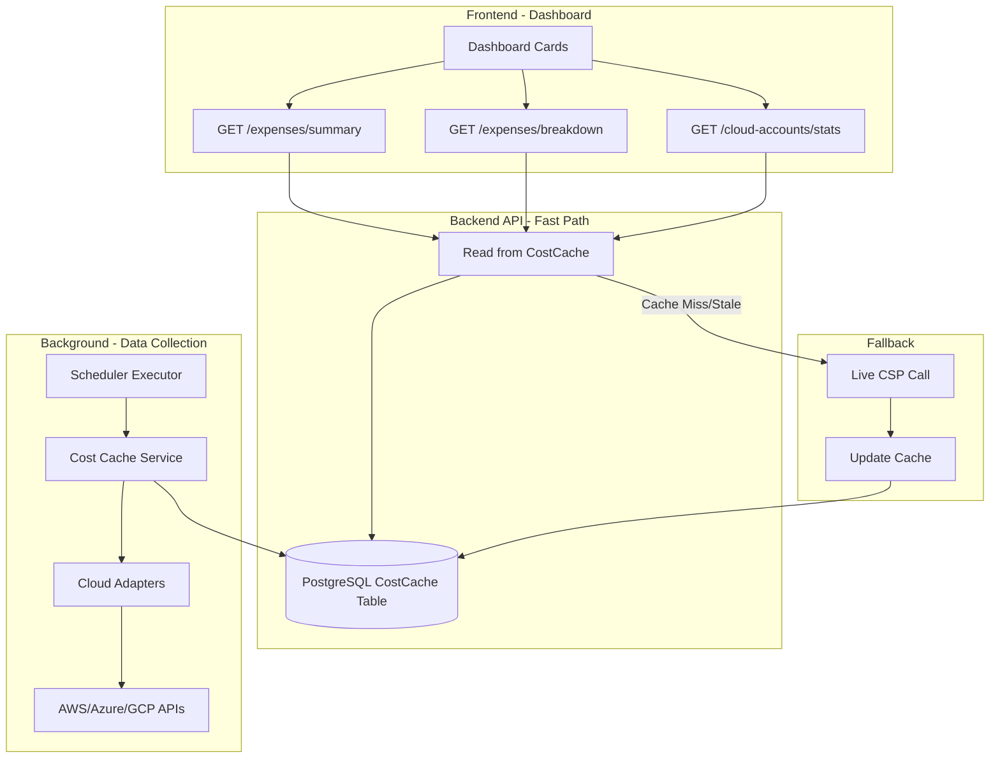

# Dashboard Cache Redesign Plan

## Overview

Redesign the dashboard to display **persisted cached data** instead of calling CSP APIs directly. This will improve performance, reliability, and user experience by eliminating timeouts and showing last-known good data.

---

## Current Architecture Analysis

### Current Flow (Problematic)

```
User loads Dashboard
    ↓
Dashboard calls GET /organizations/{orgId}/expenses/summary
    ↓
Backend fetches ALL cloud accounts from DB
    ↓
For each account:
    - Create adapter (decrypt credentials)
    - Call CSP API (AWS Cost Explorer/Azure Cost Mgmt/GCP Billing)
    - 20-second timeout per account
    ↓
Aggregate results
    ↓
Return to frontend
```

### Current Caching (Inadequate)

| Cache Location | Type | TTL | Issues |
|----------------|------|-----|--------|
| `expenses/service.py` | In-memory dict | 5 min | Lost on restart, per-process only |
| `cloud_accounts/router.py` | In-memory dict | 5 min | Only for live-data endpoint, separate from expenses |
| `cloud_cache.py` | Redis + Memory | 5 min | Not used for dashboard summary |

### Key Problems

1. **Timeouts**: 20-second timeout per account × N accounts = high failure rate
2. **Cache Volatility**: In-memory cache lost on every deployment/restart
3. **No Data Persistence**: Failed API calls return zeros, not cached values
4. **Separate Caches**: Dashboard and data sources use different cache systems
5. **Cold Start**: First request after cache expiry triggers slow live fetch

---

## Proposed Architecture

### New Flow (Optimized)

```
User loads Dashboard
    ↓
Dashboard calls GET /organizations/{orgId}/expenses/summary
    ↓
Backend queries persisted CostCache table (PostgreSQL)
    ↓
Return cached data immediately (< 100ms)
    ↓
[Background] Scheduler refreshes cache periodically
```

### High-Level Architecture



---

## Database Schema Design

### New Table: `cost_cache`

```sql
-- Stores aggregated cost data for fast dashboard retrieval
CREATE TABLE cost_cache (
    id UUID PRIMARY KEY DEFAULT gen_random_uuid(),
    organization_id UUID NOT NULL REFERENCES organizations(id),
    cloud_account_id UUID REFERENCES cloud_accounts(id), -- NULL for org-wide totals
    
    -- Data type: 'summary', 'breakdown', 'daily', 'forecast'
    cache_type VARCHAR(20) NOT NULL,
    
    -- Time period this data covers
    period_start DATE NOT NULL,
    period_end DATE NOT NULL,
    
    -- Cost values (all in USD)
    this_month_total DECIMAL(15, 2) DEFAULT 0,
    last_month_total DECIMAL(15, 2) DEFAULT 0,
    forecast_total DECIMAL(15, 2) DEFAULT 0,
    change_percent DECIMAL(5, 2) DEFAULT 0,
    
    -- For breakdown data (stored as JSONB)
    breakdown_data JSONB DEFAULT NULL,
    
    -- Metadata
    currency VARCHAR(3) DEFAULT 'USD',
    
    -- Cache status
    data_source VARCHAR(20) DEFAULT 'live', -- 'live', 'cache', 'stale', 'error'
    
    -- Timestamps
    collected_at TIMESTAMP WITH TIME ZONE NOT NULL DEFAULT NOW(),
    expires_at TIMESTAMP WITH TIME ZONE NOT NULL,
    created_at TIMESTAMP WITH TIME ZONE NOT NULL DEFAULT NOW(),
    updated_at TIMESTAMP WITH TIME ZONE NOT NULL DEFAULT NOW(),
    
    -- Indexes for fast lookups
    CONSTRAINT cost_cache_org_type_period UNIQUE (organization_id, cache_type, cloud_account_id, period_start, period_end)
);

-- Indexes
CREATE INDEX idx_cost_cache_org_lookup ON cost_cache(organization_id, cache_type, expires_at);
CREATE INDEX idx_cost_cache_account ON cost_cache(cloud_account_id, expires_at);
CREATE INDEX idx_cost_cache_expires ON cost_cache(expires_at) WHERE expires_at < NOW();
```

### New Table: `cost_cache_status`

```sql
-- Tracks the overall cache health per organization
CREATE TABLE cost_cache_status (
    id UUID PRIMARY KEY DEFAULT gen_random_uuid(),
    organization_id UUID NOT NULL UNIQUE REFERENCES organizations(id),
    
    -- Last successful collection
    last_successful_collection TIMESTAMP WITH TIME ZONE,
    last_collection_status VARCHAR(20) DEFAULT 'pending', -- 'success', 'partial', 'failed'
    
    -- What was collected
    accounts_total INTEGER DEFAULT 0,
    accounts_success INTEGER DEFAULT 0,
    accounts_failed INTEGER DEFAULT 0,
    
    -- Error info (if failed)
    last_error_message TEXT,
    
    -- Next scheduled collection
    next_collection_at TIMESTAMP WITH TIME ZONE,
    
    -- Timestamps
    created_at TIMESTAMP WITH TIME ZONE NOT NULL DEFAULT NOW(),
    updated_at TIMESTAMP WITH TIME ZONE NOT NULL DEFAULT NOW()
);
```

---

## API Changes

### Modified Endpoint: `GET /organizations/{orgId}/expenses/summary`

**Current Behavior:**
- Fetches live data from all CSP APIs
- 20-second timeout per account
- Returns zeros on failure

**New Behavior:**
1. Query `cost_cache` table for org-wide summary
2. If cache exists and not expired → return cached data
3. If cache missing/expired → trigger background refresh → return stale data with warning
4. Never block on live CSP API calls

**Response Schema (unchanged, but faster):**
```json
{
  "this_month_total": 12345.67,
  "last_month_total": 11200.00,
  "this_month_forecast": 15000.00,
  "change_percent": 15.5,
  "data_source": "cache",  // NEW: 'cache', 'live', 'stale'
  "cached_at": "2026-04-03T00:00:00Z",  // NEW
  "expires_at": "2026-04-03T06:00:00Z"  // NEW
}
```

### Modified Endpoint: `GET /organizations/{orgId}/expenses/breakdown`

**New Behavior:**
1. Query `cost_cache` table for breakdown data
2. Return cached breakdown or trigger refresh

### New Endpoint: `POST /organizations/{orgId}/expenses/refresh`

**Purpose:** Manual trigger to refresh cost cache

**Request:**
```json
{
  "force": false  // If true, bypass cache even if not expired
}
```

**Response:**
```json
{
  "status": "refreshing",
  "message": "Cost cache refresh started",
  "estimated_completion": "2026-04-03T01:35:00Z"
}
```

### New Endpoint: `GET /organizations/{orgId}/expenses/cache-status`

**Purpose:** Show cache health to users

**Response:**
```json
{
  "status": "healthy",  // 'healthy', 'stale', 'error'
  "last_updated": "2026-04-03T00:00:00Z",
  "next_update": "2026-04-03T06:00:00Z",
  "accounts_cached": 3,
  "accounts_total": 3,
  "is_refreshing": false
}
```

---

## Cache Refresh Strategy

### Option 1: Extend Existing Scheduler (Recommended)

Leverage the existing scheduler system (`backend/app/scheduler/`) to periodically refresh cost data.

**Scheduler Job Configuration:**
```python
# Default scheduler config for cost caching
default_cost_cache_job = {
    "name": "Cost Cache Refresh",
    "collect_expenses": True,
    "collect_resources": False,
    "collect_recommendations": False,
    "schedule_type": "interval",
    "interval_minutes": 360,  # Every 6 hours
    "is_enabled": True
}
```

**Benefits:**
- Reuses existing scheduler infrastructure
- Automatic retry logic
- Built-in monitoring and logging
- User-configurable frequency

### Option 2: Dedicated Background Worker

Create a separate Celery/APScheduler worker for cost caching.

**Pros:** More control, independent scaling
**Cons:** More infrastructure to maintain

### Refresh Logic

```python
async def refresh_cost_cache(org_id: str) -> CostCacheResult:
    """Refresh cost cache for an organization."""
    
    # 1. Get all cloud accounts
    accounts = await get_cloud_accounts(org_id)
    
    # 2. Fetch costs for each account (with individual timeouts)
    results = []
    for account in accounts:
        try:
            costs = await fetch_account_costs_with_timeout(account, timeout=60)
            results.append((account, costs))
        except Exception as e:
            logger.error(f"Failed to fetch costs for {account.id}: {e}")
            results.append((account, None))
    
    # 3. Aggregate and store
    org_total = aggregate_costs(results)
    
    # 4. Persist to database
    await save_to_cost_cache(org_id, org_total)
    
    # 5. Update status
    await update_cache_status(org_id, results)
    
    return CostCacheResult(
        success_count=sum(1 for r in results if r[1] is not None),
        total_count=len(results)
    )
```

---

## Frontend Changes

### Dashboard Cards Enhancement

**Current Cards:**
- Monthly Spend
- Forecast
- Last Month
- Change Percentage

**New Features:**

1. **Cache Status Indicator**
   - Small badge showing data freshness
   - "Updated 2 hours ago" / "Refreshing..."
   - Warning icon if data is stale (> 24 hours)

2. **Manual Refresh Button**
   - "Refresh Data" button on dashboard
   - Shows spinner while refreshing
   - Disabled during refresh

3. **Staleness Warnings**
   - Orange border if cache is > 6 hours old
   - Red border if cache is > 24 hours old
   - Tooltip explaining data age

### Component Changes

```typescript
// Enhanced dashboard summary hook
interface UseDashboardSummaryOptions {
  useCache: boolean;        // default: true
  allowStale: boolean;      // default: true
  autoRefresh: boolean;     // default: false
}

interface DashboardSummary {
  thisMonthTotal: number;
  lastMonthTotal: number;
  forecast: number;
  changePercent: number;
  dataSource: 'cache' | 'live' | 'stale';
  cachedAt: string;
  expiresAt: string;
  isRefreshing: boolean;
}
```

---

## Implementation Plan

### Phase 1: Database & Models (Day 1-2)

1. **Create Alembic Migration**
   - `cost_cache` table
   - `cost_cache_status` table
   - Indexes

2. **Create SQLAlchemy Models**
   - `backend/app/cost_cache/models.py`
   - Pydantic schemas in `backend/app/cost_cache/schemas.py`

3. **Update Database Module**
   - Add models to `backend/app/database.py`

### Phase 2: Cache Service Layer (Day 3-4)

1. **Create Cost Cache Service**
   - `backend/app/cost_cache/service.py`
   - `get_cached_summary(org_id)`
   - `get_cached_breakdown(org_id, ...)`
   - `refresh_cache(org_id)`
   - `get_cache_status(org_id)`

2. **Cache Refresh Logic**
   - Integrate with scheduler executor
   - Handle partial failures gracefully
   - Store aggregated data

### Phase 3: API Router Updates (Day 5)

1. **Update Expenses Router**
   - Modify `/expenses/summary` to use cache
   - Modify `/expenses/breakdown` to use cache
   - Add `/expenses/refresh` endpoint
   - Add `/expenses/cache-status` endpoint

2. **Add Cache Bypass Option**
   - Query param `?fresh=true` for live data

### Phase 4: Scheduler Integration (Day 6)

1. **Extend Scheduler Executor**
   - Add cost cache refresh task
   - Handle expense collection in scheduler

2. **Default Scheduler Config**
   - Auto-create default cost cache scheduler on org creation

### Phase 5: Frontend Updates (Day 7-8)

1. **Update Dashboard Component**
   - Add cache status indicators
   - Add manual refresh button
   - Handle stale data warnings

2. **Update API Types**
   - Add new fields to `ExpenseSummary` interface

3. **Add Refresh Hook**
   - `useCostCacheRefresh()` hook

### Phase 6: Testing & Optimization (Day 9-10)

1. **Unit Tests**
   - Cache service tests
   - API endpoint tests

2. **Integration Tests**
   - End-to-end cache refresh flow
   - Fallback to live data on cache miss

3. **Performance Testing**
   - Measure API response times
   - Verify < 100ms for cached responses

---

## Affected Files

### Backend

| File | Change |
|------|--------|
| `backend/app/database.py` | Add new models |
| `backend/app/cost_cache/models.py` | **NEW** - SQLAlchemy models |
| `backend/app/cost_cache/schemas.py` | **NEW** - Pydantic schemas |
| `backend/app/cost_cache/service.py` | **NEW** - Cache service layer |
| `backend/app/cost_cache/router.py` | **NEW** - Cache status endpoints |
| `backend/app/expenses/router.py` | Modify to use cache |
| `backend/app/expenses/service.py` | Add cache-first logic |
| `backend/app/scheduler/executor.py` | Add cost cache refresh task |
| `alembic/versions/` | **NEW** - Migration for cost_cache tables |

### Frontend

| File | Change |
|------|--------|
| `frontend/src/api/expenses.ts` | Update types, add refresh endpoint |
| `frontend/src/pages/Dashboard.tsx` | Add cache status UI |
| `frontend/src/hooks/useDashboard.ts` | **NEW** - Dashboard data hook |
| `frontend/src/components/dashboard/` | **NEW** - Cache status components |

---

## Configuration

Add to `backend/app/config.py`:

```python
# Cost Cache Settings
COST_CACHE_ENABLED: bool = True
COST_CACHE_TTL_HOURS: int = 6  # How long cached data is considered fresh
COST_CACHE_STALE_HOURS: int = 24  # When to show staleness warnings
COST_CACHE_AUTO_REFRESH: bool = True  # Auto-refresh via scheduler
COST_CACHE_FALLBACK_TO_LIVE: bool = True  # Call CSP APIs on cache miss
```

---

## Migration Strategy

1. **Database Migration** - Run Alembic migration to create tables
2. **Backfill Data** - On first deploy, trigger cache refresh for all orgs
3. **Gradual Rollout** - Feature flag to enable new behavior
4. **Monitor** - Track cache hit rates and refresh success rates

---

## Success Metrics

| Metric | Current | Target |
|--------|---------|--------|
| Dashboard Load Time | 5-30s | < 1s |
| API Success Rate | ~70% | > 99% |
| CSP API Calls (dashboard) | N per load | 0 (uses cache) |
| User-Reported Timeouts | High | 0 |

