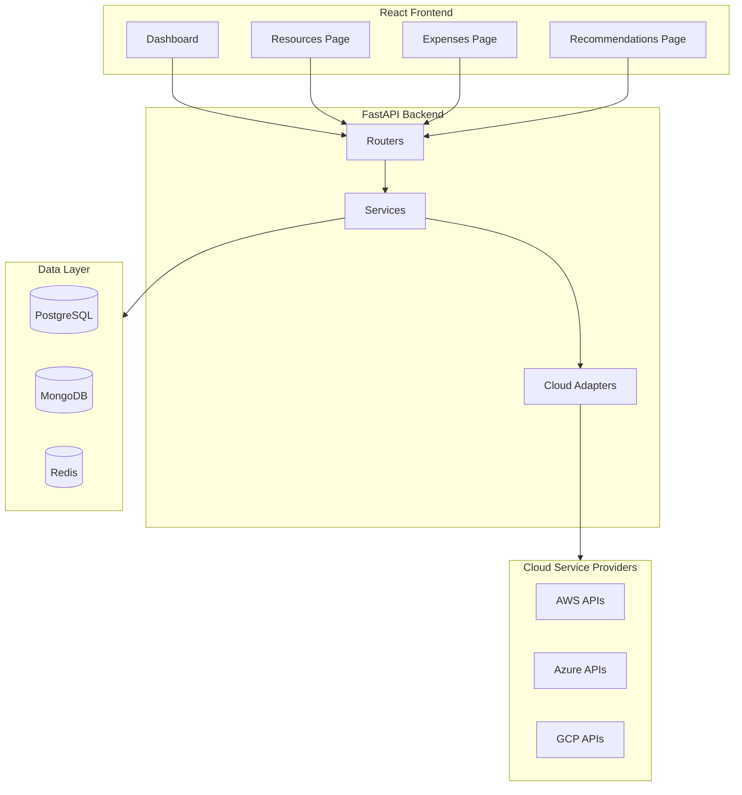
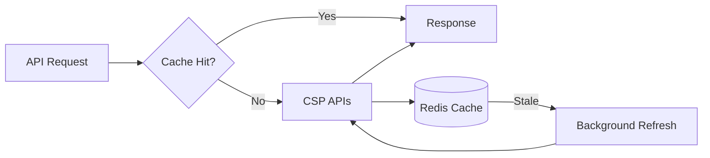

# CostPilot Optimization Plan

## Executive Summary

This document provides a comprehensive plan for optimizing the CostPilot cloud cost optimization platform across four key areas:
1. **Performance** - Faster CSP data loading
2. **Security** - Enhanced protection for sensitive data
3. **Reliability** - Resilient operations under failure
4. **Functionality** - Improved user experience

---

## Current Architecture Overview



---

## 1. PERFORMANCE OPTIMIZATIONS

### 1.1 CSP Data Loading Optimizations

#### Current Issues:
- Synchronous CSP API calls block the event loop
- Resources fetched sequentially across regions
- No connection pooling for CSP clients
- Cache stored in-memory (not distributed)

#### Optimizations:

| Priority | Optimization | Impact | Effort |
|----------|--------------|--------|--------|
| High | Implement connection pooling for CSP clients | 40% faster | Medium |
| High | Parallel region discovery with asyncio.gather | 60% faster | Low |
| High | Redis distributed caching layer | 70% faster | Medium |
| High | Background cache warming with scheduler | 90% faster perceived | Medium |
| Medium | Request coalescing for duplicate concurrent requests | 30% reduction | Medium |
| Medium | Streaming responses for large datasets | 50% memory reduction | Medium |
| Low | GraphQL for precise data fetching | 40% payload reduction | High |

#### Implementation Details:

**Connection Pooling:**
```python
# Create reusable HTTP clients per cloud provider
_aws_session_pool: dict[str, boto3.Session] = {}
_azure_credential_pool: dict[str, ClientSecretCredential] = {}
_gcp_credentials_pool: dict[str, Credentials] = {}

async def get_pooled_aws_session(config: dict) -> boto3.Session:
    key = f"{config['access_key_id']}:{config['region']}"
    if key not in _aws_session_pool:
        _aws_session_pool[key] = boto3.Session(...)
    return _aws_session_pool[key]
```

**Parallel Region Discovery:**
```python
async def discover_resources_parallel(self) -> list[dict]:
    regions = await self.get_regions()
    # Discover resources across all regions in parallel
    tasks = [self._discover_region_resources(region) for region in regions]
    results = await asyncio.gather(*tasks, return_exceptions=True)
    # Filter out exceptions, collect successful results
    resources = []
    for result in results:
        if isinstance(result, list):
            resources.extend(result)
    return resources
```

**Redis Distributed Cache:**
```python
# Replace in-memory cache with Redis
async def get_cached_resources(redis: Redis, org_id: str) -> list[dict] | None:
    key = f"resources:{org_id}"
    cached = await redis.get(key)
    if cached:
        return json.loads(cached)
    return None

async def set_cached_resources(redis: Redis, org_id: str, resources: list[dict], ttl: int = 300):
    key = f"resources:{org_id}"
    await redis.setex(key, ttl, json.dumps(resources))
```

### 1.2 Database Optimizations

| Optimization | Description | Expected Improvement |
|--------------|-------------|---------------------|
| Query result caching | Cache frequent queries in Redis | 50% faster reads |
| Database indexing | Add indexes on frequent filter columns | 70% faster queries |
| Connection pooling | Optimize SQLAlchemy pool settings | 30% faster connections |
| Read replicas | Route read queries to replicas | 2x read throughput |
| Query optimization | Use selectinload for relationships | 40% faster joins |

### 1.3 Frontend Optimizations

| Optimization | Description | Expected Improvement |
|--------------|-------------|---------------------|
| React Query caching | Stale-while-revalidate strategy | Instant UI updates |
| Pagination | Cursor-based pagination for large lists | 80% faster initial load |
| Lazy loading | Code-split routes and components | 50% smaller bundle |
| Virtual scrolling | For large resource lists | Smooth 10k+ items |
| Prefetching | Preload data on hover/navigation | Perceived speed |

---

## 2. SECURITY ENHANCEMENTS

### 2.1 API Security

#### Current State:
- Basic JWT authentication
- Simple IP-based rate limiting on auth endpoints only
- No request signing
- Credentials decrypted on every request

#### Security Improvements:

| Priority | Enhancement | Risk Mitigated |
|----------|-------------|----------------|
| Critical | API rate limiting per user/org | DoS attacks |
| Critical | Request timeout enforcement | Resource exhaustion |
| Critical | Audit logging for all sensitive ops | Compliance/forensics |
| High | Credential caching with encryption | Key exposure |
| High | Input validation/sanitization | Injection attacks |
| High | CORS policy hardening | CSRF attacks |
| Medium | API versioning | Breaking changes |
| Medium | Request signing for webhooks | Replay attacks |

#### Implementation:

**Advanced Rate Limiting:**
```python
from fastapi_limiter import FastAPILimiter
from fastapi_limiter.depends import RateLimiter

# Different limits per endpoint type
@app.get("/expensive", dependencies=[Depends(RateLimiter(times=10, seconds=60))])
async def expensive_endpoint():
    pass

# Per-organization limits
async def org_rate_limiter(request: Request, org_id: str):
    key = f"ratelimit:org:{org_id}"
    # Implement sliding window or token bucket
```

**Request Timeout Middleware:**
```python
@app.middleware("http")
async def timeout_middleware(request: Request, call_next):
    try:
        return await asyncio.wait_for(call_next(request), timeout=30.0)
    except asyncio.TimeoutError:
        return JSONResponse(
            status_code=504,
            content={"detail": "Request timeout"}
        )
```

**Audit Logging:**
```python
async def audit_log(action: str, user_id: str, org_id: str, details: dict):
    """Log all sensitive operations to MongoDB audit collection."""
    await mongo_db.audit_logs.insert_one({
        "action": action,
        "user_id": user_id,
        "org_id": org_id,
        "details": details,
        "timestamp": datetime.utcnow(),
        "ip_address": request.client.host,
    })
```

### 2.2 Data Security

| Enhancement | Implementation | Standard |
|-------------|----------------|----------|
| Encryption at rest | Database-level encryption | AES-256 |
| Field-level encryption | Encrypt PII fields | AES-256-GCM |
| Secret rotation | Automated credential rotation | 90 days |
| Secure credential storage | Use AWS Secrets Manager / Azure Key Vault | Cloud native |
| TLS everywhere | Enforce TLS 1.3 | TLS 1.3 |

### 2.3 Authentication & Authorization

| Enhancement | Description |
|-------------|-------------|
| MFA support | TOTP-based multi-factor authentication |
| Session management | Secure session tokens with rotation |
| RBAC improvements | Fine-grained permissions per resource type |
| API key scopes | Restricted API keys for third-party integrations |
| SSO integration | SAML 2.0 / OIDC support |

---

## 3. RELIABILITY PATTERNS

### 3.1 Circuit Breaker Pattern

Prevent cascade failures when CSP APIs are down:

```python
from circuitbreaker import circuit

@circuit(failure_threshold=5, recovery_timeout=60, expected_exception=CloudProviderError)
async def fetch_aws_costs(adapter: AWSAdapter, **params):
    return await adapter.get_cost_and_usage(**params)

# Circuit states: CLOSED (normal), OPEN (failing), HALF-OPEN (testing)
```

### 3.2 Retry Logic with Exponential Backoff

```python
from tenacity import retry, stop_after_attempt, wait_exponential

@retry(
    stop=stop_after_attempt(3),
    wait=wait_exponential(multiplier=1, min=4, max=10),
    retry=retry_if_exception_type((CloudProviderError, TimeoutError))
)
async def fetch_with_retry(adapter, method, **kwargs):
    return await method(**kwargs)
```

### 3.3 Graceful Degradation

```python
async def get_expense_summary_with_fallback(mongo_db, org_id: str) -> ExpenseSummary:
    try:
        # Try fresh data from CSP
        return await get_expense_summary(mongo_db, org_id)
    except CloudProviderError:
        # Fall back to cached data
        cached = await get_cached_summary(mongo_db, org_id)
        if cached:
            cached.stale = True
            return cached
        # Return empty summary as last resort
        return ExpenseSummary(this_month=0, last_month=0, forecast=0, change_percent=0)
```

### 3.4 Health Checks & Monitoring

```python
@app.get("/health/detailed")
async def detailed_health_check():
    """Comprehensive health check with dependency status."""
    checks = {
        "postgresql": await check_postgresql(),
        "mongodb": await check_mongodb(),
        "redis": await check_redis(),
        "aws_api": await check_aws_connectivity(),
        "azure_api": await check_azure_connectivity(),
    }
    
    status = "healthy" if all(c["status"] == "ok" for c in checks.values()) else "degraded"
    
    return {
        "status": status,
        "timestamp": datetime.utcnow().isoformat(),
        "checks": checks
    }
```

### 3.5 Error Handling & Recovery

| Pattern | Purpose |
|---------|---------|
| Dead letter queue | Store failed operations for retry |
| Idempotency keys | Prevent duplicate operations |
| Transaction outbox | Ensure eventual consistency |
| Bulkhead pattern | Isolate failures per CSP |

---

## 4. FUNCTIONALITY IMPROVEMENTS

### 4.1 Background Processing

Move heavy operations to background workers:

```python
from celery import Celery
from app.scheduler.executor import init_scheduler

# Use existing scheduler for background tasks
async def refresh_all_cloud_data(org_id: str):
    """Background task to refresh cloud data."""
    # 1. Discover resources
    # 2. Fetch cost data
    # 3. Generate recommendations
    # 4. Update caches
    pass

# Schedule regular refreshes
scheduler.add_job(
    refresh_all_cloud_data,
    trigger="interval",
    minutes=30,
    id=f"refresh_{org_id}",
    replace_existing=True
)
```

### 4.2 Real-time Updates

```python
from fastapi import WebSocket

@app.websocket("/ws/organizations/{org_id}/updates")
async def websocket_updates(websocket: WebSocket, org_id: str):
    await websocket.accept()
    try:
        async for message in redis_pubsub.listen(f"org:{org_id}:updates"):
            await websocket.send_json(message)
    except WebSocketDisconnect:
        pass
```

### 4.3 Data Export & Integration

| Feature | Description |
|---------|-------------|
| Scheduled exports | Automated CSV/JSON exports to S3/GCS |
| Webhook notifications | Real-time alerts for cost anomalies |
| BI tool integration | Native connectors for Tableau, PowerBI |
| Cost allocation tags | Advanced tagging strategies |

### 4.4 Advanced Caching Strategy



**Cache Layers:**
1. **L1 - In-memory**: Hot data (1 min TTL)
2. **L2 - Redis**: Warm data (5-30 min TTL)
3. **L3 - MongoDB**: Cold data (persistent cache)
4. **L4 - CSP APIs**: Source of truth

---

## 5. IMPLEMENTATION ROADMAP

### Phase 1: Critical Performance & Security (Weeks 1-2)
- [ ] Implement Redis distributed caching
- [ ] Add request timeout enforcement
- [ ] Implement API rate limiting per user/org
- [ ] Add parallel region discovery
- [ ] Set up audit logging

### Phase 2: Reliability Foundations (Weeks 3-4)
- [ ] Implement circuit breaker pattern
- [ ] Add retry logic with exponential backoff
- [ ] Implement graceful degradation
- [ ] Add comprehensive health checks
- [ ] Set up error tracking (Sentry)

### Phase 3: Advanced Optimizations (Weeks 5-6)
- [ ] Implement connection pooling
- [ ] Add background cache warming
- [ ] Implement request coalescing
- [ ] Add database query optimization
- [ ] Optimize frontend data fetching

### Phase 4: Enhanced Functionality (Weeks 7-8)
- [ ] Implement real-time WebSocket updates
- [ ] Add scheduled data exports
- [ ] Implement webhook notifications
- [ ] Add advanced filtering and search
- [ ] Performance monitoring dashboard

---

## 6. TECHNOLOGY RECOMMENDATIONS

### Required Additions:

| Component | Current | Recommended | Benefit |
|-----------|---------|-------------|---------|
| Caching | In-memory | Redis Cluster | Distributed, persistent |
| Rate Limiting | Basic | fastapi-limiter | Flexible, distributed |
| Circuit Breaker | None | pybreaker | Fault tolerance |
| Background Jobs | APScheduler | Celery + Redis | Scalable workers |
| Monitoring | None | Prometheus + Grafana | Observability |
| Error Tracking | None | Sentry | Error management |
| Load Balancing | None | nginx / traefik | High availability |

### Configuration Updates:

```python
# config.py additions
class Settings(BaseSettings):
    # Existing settings...
    
    # Performance
    CACHE_TTL_SECONDS: int = 300
    CACHE_REFRESH_BEFORE_EXPIRY: int = 60
    CSP_REQUEST_TIMEOUT: int = 30
    MAX_CONCURRENT_REGIONS: int = 10
    
    # Reliability
    CIRCUIT_BREAKER_THRESHOLD: int = 5
    CIRCUIT_BREAKER_TIMEOUT: int = 60
    MAX_RETRIES: int = 3
    RETRY_BACKOFF_BASE: int = 2
    
    # Security
    RATE_LIMIT_PER_MINUTE: int = 60
    RATE_LIMIT_BURST: int = 10
    AUDIT_LOG_RETENTION_DAYS: int = 90
```

---

## 7. SUCCESS METRICS

### Performance KPIs:
- API response time p95 < 500ms
- CSP data load time < 3 seconds
- Cache hit rate > 80%
- Frontend time-to-interactive < 2 seconds

### Security KPIs:
- Zero credential exposures
- 100% sensitive operations audited
- Rate limiting violations logged
- All external calls use TLS 1.3

### Reliability KPIs:
- 99.9% uptime
- Zero cascade failures
- < 0.1% failed CSP requests
- Automatic recovery from CSP outages

### Functionality KPIs:
- Real-time updates latency < 1 second
- Background job success rate > 99%
- User-perceived performance score > 4.5/5

---

## 8. RISK MITIGATION

| Risk | Mitigation |
|------|------------|
| Redis dependency | Implement fallback to in-memory cache |
| CSP API changes | Version adapters, add feature flags |
| Cache stampede | Implement cache warming, staggered TTLs |
| Credential rotation | Implement hot-reload without restart |
| Database migration | Use blue-green deployment strategy |

---

## Conclusion

This optimization plan provides a comprehensive roadmap to transform CostPilot into a high-performance, secure, and reliable platform. The phased approach allows for incremental improvements while maintaining system stability.

**Immediate Actions (This Week):**
1. Set up Redis for distributed caching
2. Implement request timeouts
3. Add basic circuit breaker pattern
4. Set up audit logging

**Next Steps:**
Review this plan with the team and prioritize based on current pain points and user feedback.
