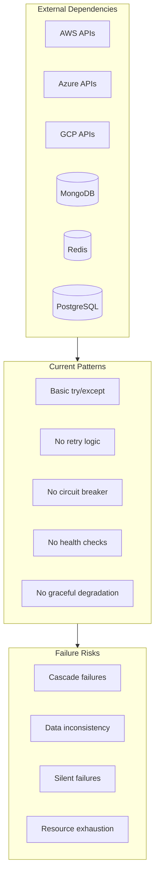

# CostPilot Reliability Enhancement Plan

## Executive Summary

This plan outlines comprehensive reliability improvements for CostPilot, focusing on error handling, fault tolerance, graceful degradation, and operational resilience to ensure the platform remains stable under failure conditions.

---

## 1. RELIABILITY ANALYSIS

### 1.1 Current Reliability State



### 1.2 Failure Scenarios Analysis

| Component | Failure Mode | Current Impact | Target Impact |
|-----------|--------------|----------------|---------------|
| CSP API (AWS/Azure/GCP) | Timeout/Error | Request fails, user sees error | Return cached data, log error |
| MongoDB | Connection lost | All data operations fail | Queue for retry, return stale data |
| Redis | Connection lost | No caching | Fall back to in-memory cache |
| PostgreSQL | Connection lost | All auth/org operations fail | Connection pool retry, circuit breaker |
| CSP Rate Limit | 429 Response | Request fails | Exponential backoff, queue requests |
| Memory Exhaustion | OOM | Process crashes | Request rejection, graceful shutdown |

---

## 2. ERROR HANDLING ARCHITECTURE

### 2.1 Structured Exception Hierarchy

```python
# app/shared/exceptions.py (Extended)
from fastapi import HTTPException, status
from typing import Optional, Any
import uuid

class AppException(Exception):
    """Base application exception with error tracking."""
    
    def __init__(
        self,
        message: str,
        error_code: str,
        status_code: int = 500,
        details: Optional[dict] = None,
        retryable: bool = False
    ):
        super().__init__(message)
        self.message = message
        self.error_code = error_code
        self.status_code = status_code
        self.details = details or {}
        self.retryable = retryable
        self.error_id = str(uuid.uuid4())[:8]
    
    def to_dict(self) -> dict:
        return {
            "error": {
                "code": self.error_code,
                "message": self.message,
                "error_id": self.error_id,
                "retryable": self.retryable,
                **self.details
            }
        }

# Domain-specific exceptions
class CloudProviderException(AppException):
    """Exception for cloud provider API failures."""
    
    def __init__(
        self,
        provider: str,
        message: str,
        error_code: str = "CLOUD_PROVIDER_ERROR",
        retryable: bool = True,
        **kwargs
    ):
        super().__init__(
            message=f"{provider}: {message}",
            error_code=error_code,
            status_code=502,
            retryable=retryable,
            details={"provider": provider, **kwargs}
        )

class CacheException(AppException):
    """Exception for cache-related failures."""
    
    def __init__(self, message: str, fallback_available: bool = True):
        super().__init__(
            message=message,
            error_code="CACHE_ERROR",
            status_code=503 if not fallback_available else 200,
            retryable=True,
            details={"fallback_available": fallback_available}
        )

class DatabaseException(AppException):
    """Exception for database failures."""
    
    def __init__(self, message: str, retryable: bool = True):
        super().__init__(
            message=message,
            error_code="DATABASE_ERROR",
            status_code=503,
            retryable=retryable
        )

class ValidationException(AppException):
    """Exception for validation failures."""
    
    def __init__(self, message: str, field: Optional[str] = None):
        super().__init__(
            message=message,
            error_code="VALIDATION_ERROR",
            status_code=400,
            retryable=False,
            details={"field": field} if field else {}
        )

class RateLimitException(AppException):
    """Exception for rate limit violations."""
    
    def __init__(self, message: str, retry_after: int = 60):
        super().__init__(
            message=message,
            error_code="RATE_LIMIT_EXCEEDED",
            status_code=429,
            retryable=True,
            details={"retry_after": retry_after}
        )
```

**Implementation Tasks:**
- [ ] Extend [`app/shared/exceptions.py`](backend/app/shared/exceptions.py:1) with structured exception hierarchy
- [ ] Add error code system for all error types
- [ ] Implement error ID tracking for debugging
- [ ] Add retryable flag for automatic retry decisions
- [ ] Update all services to use new exception types

### 2.2 Global Exception Handler

```python
# app/middleware/exception_handler.py
import traceback
import logging
from fastapi import Request
from fastapi.responses import JSONResponse
from starlette.middleware.base import BaseHTTPMiddleware
from app.shared.exceptions import AppException
from app.security.audit_logger import AuditLogger, AuditEventType

logger = logging.getLogger(__name__)

class GlobalExceptionHandler(BaseHTTPMiddleware):
    """Centralized exception handling with logging and metrics."""
    
    async def dispatch(self, request: Request, call_next):
        try:
            return await call_next(request)
        except AppException as e:
            return await self._handle_app_exception(request, e)
        except Exception as e:
            return await self._handle_unexpected_exception(request, e)
    
    async def _handle_app_exception(
        self, 
        request: Request, 
        exc: AppException
    ) -> JSONResponse:
        """Handle known application exceptions."""
        
        # Log structured error
        logger.warning(
            f"Application error: {exc.error_code}",
            extra={
                "error_id": exc.error_id,
                "error_code": exc.error_code,
                "path": request.url.path,
                "method": request.method,
                "retryable": exc.retryable
            }
        )
        
        # Audit log for security-relevant errors
        if exc.status_code >= 400:
            await self._audit_log_error(request, exc)
        
        response_data = exc.to_dict()
        
        # Add debugging info in development
        if self._is_development():
            response_data["error"]["debug"] = {
                "traceback": traceback.format_exc()
            }
        
        headers = {}
        if exc.error_code == "RATE_LIMIT_EXCEEDED":
            headers["Retry-After"] = str(exc.details.get("retry_after", 60))
        
        return JSONResponse(
            status_code=exc.status_code,
            content=response_data,
            headers=headers
        )
    
    async def _handle_unexpected_exception(
        self, 
        request: Request, 
        exc: Exception
    ) -> JSONResponse:
        """Handle unexpected exceptions."""
        
        error_id = str(uuid.uuid4())[:8]
        
        # Log full stack trace
        logger.exception(
            f"Unexpected error: {error_id}",
            extra={
                "error_id": error_id,
                "path": request.url.path,
                "method": request.method
            }
        )
        
        # Audit log critical error
        await self._audit_log_error(request, exc, critical=True)
        
        response = {
            "error": {
                "code": "INTERNAL_ERROR",
                "message": "An unexpected error occurred",
                "error_id": error_id
            }
        }
        
        if self._is_development():
            response["error"]["debug"] = {
                "type": type(exc).__name__,
                "message": str(exc),
                "traceback": traceback.format_exc()
            }
        
        return JSONResponse(
            status_code=500,
            content=response
        )
    
    def _is_development(self) -> bool:
        from app.config import settings
        return settings.DEBUG
    
    async def _audit_log_error(self, request: Request, exc: Exception, critical: bool = False):
        """Log errors to audit system."""
        # Implementation for audit logging
        pass
```

**Implementation Tasks:**
- [ ] Create `app/middleware/exception_handler.py` with centralized exception handling
- [ ] Register middleware in [`main.py`](backend/app/main.py:1)
- [ ] Add structured logging with correlation IDs
- [ ] Implement error alerting for critical exceptions
- [ ] Add error metrics collection

---

## 3. RESILIENCE PATTERNS

### 3.1 Circuit Breaker Pattern

```python
# app/shared/circuit_breaker.py
import asyncio
import time
from enum import Enum
from typing import Callable, Optional, Any
from functools import wraps
import logging

logger = logging.getLogger(__name__)

class CircuitState(Enum):
    CLOSED = "closed"      # Normal operation
    OPEN = "open"          # Failing, reject fast
    HALF_OPEN = "half_open"  # Testing if recovered

class CircuitBreaker:
    """Circuit breaker for external service calls."""
    
    def __init__(
        self,
        name: str,
        failure_threshold: int = 5,
        recovery_timeout: float = 60.0,
        half_open_max_calls: int = 3,
        success_threshold: int = 2,
        expected_exceptions: tuple = (Exception,)
    ):
        self.name = name
        self.failure_threshold = failure_threshold
        self.recovery_timeout = recovery_timeout
        self.half_open_max_calls = half_open_max_calls
        self.success_threshold = success_threshold
        self.expected_exceptions = expected_exceptions
        
        self.state = CircuitState.CLOSED
        self.failure_count = 0
        self.success_count = 0
        self.last_failure_time: Optional[float] = None
        self.half_open_calls = 0
        self._lock = asyncio.Lock()
    
    async def call(self, func: Callable, *args, **kwargs) -> Any:
        """Execute function with circuit breaker protection."""
        
        async with self._lock:
            if self.state == CircuitState.OPEN:
                if self._should_attempt_reset():
                    self.state = CircuitState.HALF_OPEN
                    self.half_open_calls = 0
                    self.success_count = 0
                    logger.info(f"Circuit {self.name} entering half-open state")
                else:
                    raise CircuitBreakerOpenError(self.name, self._time_until_reset())
            
            if self.state == CircuitState.HALF_OPEN:
                if self.half_open_calls >= self.half_open_max_calls:
                    raise CircuitBreakerOpenError(self.name, self._time_until_reset())
                self.half_open_calls += 1
        
        # Execute the function
        try:
            result = await func(*args, **kwargs)
            await self._on_success()
            return result
        except self.expected_exceptions as e:
            await self._on_failure()
            raise
    
    async def _on_success(self):
        """Handle successful call."""
        async with self._lock:
            if self.state == CircuitState.HALF_OPEN:
                self.success_count += 1
                if self.success_count >= self.success_threshold:
                    self._reset()
                    logger.info(f"Circuit {self.name} closed (recovered)")
            else:
                self.failure_count = max(0, self.failure_count - 1)
    
    async def _on_failure(self):
        """Handle failed call."""
        async with self._lock:
            self.failure_count += 1
            self.last_failure_time = time.time()
            
            if self.state == CircuitState.HALF_OPEN:
                self.state = CircuitState.OPEN
                logger.warning(f"Circuit {self.name} opened (recovery failed)")
            elif self.failure_count >= self.failure_threshold:
                self.state = CircuitState.OPEN
                logger.warning(f"Circuit {self.name} opened ({self.failure_count} failures)")
    
    def _should_attempt_reset(self) -> bool:
        """Check if enough time has passed to try recovery."""
        if self.last_failure_time is None:
            return True
        return (time.time() - self.last_failure_time) >= self.recovery_timeout
    
    def _time_until_reset(self) -> float:
        """Calculate time until circuit can be tested again."""
        if self.last_failure_time is None:
            return 0
        remaining = self.recovery_timeout - (time.time() - self.last_failure_time)
        return max(0, remaining)
    
    def _reset(self):
        """Reset circuit to closed state."""
        self.state = CircuitState.CLOSED
        self.failure_count = 0
        self.success_count = 0
        self.half_open_calls = 0
        self.last_failure_time = None

class CircuitBreakerOpenError(Exception):
    """Raised when circuit breaker is open."""
    
    def __init__(self, circuit_name: str, retry_after: float):
        self.circuit_name = circuit_name
        self.retry_after = retry_after
        super().__init__(f"Circuit {circuit_name} is open. Retry after {retry_after}s")

# Decorator for easy usage
def circuit_breaker(
    name: str,
    failure_threshold: int = 5,
    recovery_timeout: float = 60.0,
    expected_exceptions: tuple = (Exception,)
):
    """Decorator to apply circuit breaker to a function."""
    breaker = CircuitBreaker(
        name=name,
        failure_threshold=failure_threshold,
        recovery_timeout=recovery_timeout,
        expected_exceptions=expected_exceptions
    )
    
    def decorator(func):
        @wraps(func)
        async def wrapper(*args, **kwargs):
            return await breaker.call(func, *args, **kwargs)
        wrapper._circuit_breaker = breaker
        return wrapper
    return decorator

# Circuit breaker registry for monitoring
class CircuitBreakerRegistry:
    """Registry of all circuit breakers for monitoring."""
    
    _breakers: dict[str, CircuitBreaker] = {}
    
    @classmethod
    def register(cls, name: str, breaker: CircuitBreaker):
        cls._breakers[name] = breaker
    
    @classmethod
    def get_status(cls) -> dict:
        return {
            name: {
                "state": breaker.state.value,
                "failure_count": breaker.failure_count,
                "last_failure": breaker.last_failure_time
            }
            for name, breaker in cls._breakers.items()
        }
```

**Implementation Tasks:**
- [ ] Create `app/shared/circuit_breaker.py` with circuit breaker implementation
- [ ] Create circuit breaker instances for each CSP adapter
- [ ] Add circuit breaker status endpoint for monitoring
- [ ] Implement circuit breaker metrics collection
- [ ] Add circuit breaker to health checks

### 3.2 Retry Logic with Exponential Backoff

```python
# app/shared/retry.py
import asyncio
import random
import logging
from typing import Callable, Optional, TypeVar, Any
from functools import wraps
from datetime import datetime, timedelta

logger = logging.getLogger(__name__)
T = TypeVar('T')

class RetryConfig:
    """Configuration for retry behavior."""
    
    def __init__(
        self,
        max_attempts: int = 3,
        base_delay: float = 1.0,
        max_delay: float = 60.0,
        exponential_base: float = 2.0,
        jitter: bool = True,
        retryable_exceptions: tuple = (Exception,),
        on_retry: Optional[Callable] = None
    ):
        self.max_attempts = max_attempts
        self.base_delay = base_delay
        self.max_delay = max_delay
        self.exponential_base = exponential_base
        self.jitter = jitter
        self.retryable_exceptions = retryable_exceptions
        self.on_retry = on_retry

class RetryContext:
    """Context for tracking retry attempts."""
    
    def __init__(self, config: RetryConfig):
        self.config = config
        self.attempt = 0
        self.start_time = datetime.utcnow()
        self.errors: list[Exception] = []
    
    def should_retry(self, error: Exception) -> bool:
        """Check if we should retry based on error type and attempts."""
        if self.attempt >= self.config.max_attempts:
            return False
        return isinstance(error, self.config.retryable_exceptions)
    
    def calculate_delay(self) -> float:
        """Calculate delay before next retry with exponential backoff."""
        delay = self.config.base_delay * (self.config.exponential_base ** (self.attempt - 1))
        delay = min(delay, self.config.max_delay)
        
        if self.config.jitter:
            # Add random jitter (0-25% of delay)
            delay = delay * (0.75 + random.random() * 0.25)
        
        return delay
    
    def get_duration(self) -> timedelta:
        """Get total duration of retry attempts."""
        return datetime.utcnow() - self.start_time

async def with_retry(
    func: Callable[..., T],
    config: Optional[RetryConfig] = None,
    *args,
    **kwargs
) -> T:
    """Execute function with retry logic."""
    config = config or RetryConfig()
    context = RetryContext(config)
    
    while True:
        context.attempt += 1
        
        try:
            result = await func(*args, **kwargs)
            
            if context.attempt > 1:
                logger.info(
                    f"Function succeeded after {context.attempt} attempts",
                    extra={"duration_ms": context.get_duration().total_seconds() * 1000}
                )
            
            return result
            
        except Exception as e:
            context.errors.append(e)
            
            if not context.should_retry(e):
                logger.error(
                    f"Function failed after {context.attempt} attempts",
                    extra={"errors": [str(err) for err in context.errors]}
                )
                raise
            
            delay = context.calculate_delay()
            
            logger.warning(
                f"Attempt {context.attempt} failed: {e}. Retrying in {delay:.2f}s",
                extra={"error": str(e), "next_delay": delay}
            )
            
            if config.on_retry:
                await config.on_retry(context.attempt, e, delay)
            
            await asyncio.sleep(delay)

# Decorator for easy usage
def retry(
    max_attempts: int = 3,
    base_delay: float = 1.0,
    max_delay: float = 60.0,
    retryable_exceptions: tuple = (Exception,),
    jitter: bool = True
):
    """Decorator to add retry logic to a function."""
    config = RetryConfig(
        max_attempts=max_attempts,
        base_delay=base_delay,
        max_delay=max_delay,
        retryable_exceptions=retryable_exceptions,
        jitter=jitter
    )
    
    def decorator(func):
        @wraps(func)
        async def wrapper(*args, **kwargs):
            return await with_retry(func, config, *args, **kwargs)
        return wrapper
    return decorator

# CSP-specific retry configurations
AWS_RETRY_CONFIG = RetryConfig(
    max_attempts=5,
    base_delay=1.0,
    max_delay=30.0,
    retryable_exceptions=(ConnectionError, TimeoutError, CloudProviderException),
    jitter=True
)

AZURE_RETRY_CONFIG = RetryConfig(
    max_attempts=4,
    base_delay=2.0,
    max_delay=60.0,
    retryable_exceptions=(ConnectionError, TimeoutError, CloudProviderException),
    jitter=True
)

GCP_RETRY_CONFIG = RetryConfig(
    max_attempts=4,
    base_delay=1.5,
    max_delay=45.0,
    retryable_exceptions=(ConnectionError, TimeoutError, CloudProviderException),
    jitter=True
)
```

**Implementation Tasks:**
- [ ] Create `app/shared/retry.py` with retry implementation
- [ ] Create CSP-specific retry configurations
- [ ] Apply retry decorator to all CSP adapter methods
- [ ] Add retry metrics and logging
- [ ] Implement retry budget tracking

### 3.3 Graceful Degradation

```python
# app/shared/degradation.py
from typing import TypeVar, Callable, Optional, Any
from functools import wraps
from datetime import datetime, timedelta
import logging

logger = logging.getLogger(__name__)
T = TypeVar('T')

class DegradationStrategy:
    """Strategy for graceful degradation when services fail."""
    
    async def fallback(self, *args, **kwargs) -> Any:
        """Return fallback value when primary fails."""
        raise NotImplementedError
    
    async def should_attempt_primary(self) -> bool:
        """Check if we should attempt primary operation."""
        return True

class CacheFallbackStrategy(DegradationStrategy):
    """Fallback to cached data."""
    
    def __init__(self, cache_client, cache_key: str, max_staleness: timedelta = timedelta(hours=24)):
        self.cache = cache_client
        self.cache_key = cache_key
        self.max_staleness = max_staleness
    
    async def fallback(self, *args, **kwargs) -> Any:
        cached = await self.cache.get(self.cache_key)
        if cached:
            logger.info(f"Returning cached data for {self.cache_key}")
            return {**cached, "_stale": True, "_cached_at": datetime.utcnow().isoformat()}
        return None

class StaticFallbackStrategy(DegradationStrategy):
    """Fallback to static/default value."""
    
    def __init__(self, fallback_value: Any):
        self.fallback_value = fallback_value
    
    async def fallback(self, *args, **kwargs) -> Any:
        return self.fallback_value

class EmptyFallbackStrategy(DegradationStrategy):
    """Fallback to empty result."""
    
    async def fallback(self, *args, **kwargs) -> Any:
        return []

class DegradedResponse:
    """Wrapper for degraded responses."""
    
    def __init__(self, data: Any, is_degraded: bool = False, reason: Optional[str] = None):
        self.data = data
        self.is_degraded = is_degraded
        self.reason = reason
        self.timestamp = datetime.utcnow()
    
    def to_dict(self) -> dict:
        return {
            "data": self.data,
            "_meta": {
                "is_degraded": self.is_degraded,
                "reason": self.reason,
                "timestamp": self.timestamp.isoformat()
            }
        }

def with_fallback(strategy: DegradationStrategy):
    """Decorator for graceful degradation."""
    def decorator(func: Callable[..., T]) -> Callable[..., T]:
        @wraps(func)
        async def wrapper(*args, **kwargs) -> T:
            # Try primary operation
            if await strategy.should_attempt_primary():
                try:
                    result = await func(*args, **kwargs)
                    return DegradedResponse(result, is_degraded=False)
                except Exception as e:
                    logger.warning(f"Primary operation failed: {e}. Attempting fallback.")
            
            # Try fallback
            try:
                fallback_result = await strategy.fallback(*args, **kwargs)
                if fallback_result is not None:
                    return DegradedResponse(
                        fallback_result, 
                        is_degraded=True, 
                        reason=str(e)
                    )
            except Exception as fallback_error:
                logger.error(f"Fallback also failed: {fallback_error}")
            
            # Both failed - re-raise original error
            raise
        
        return wrapper
    return decorator

# Usage examples for different scenarios

async def get_expense_summary_with_fallback(org_id: str, mongo_db, cache) -> DegradedResponse:
    """Get expense summary with fallback to cached data."""
    
    strategy = CacheFallbackStrategy(
        cache_client=cache,
        cache_key=f"expenses:summary:{org_id}",
        max_staleness=timedelta(hours=6)
    )
    
    @with_fallback(strategy)
    async def fetch_fresh_data():
        # Fetch from CSP APIs
        return await get_expense_summary(mongo_db, org_id)
    
    return await fetch_fresh_data()

async def get_recommendations_with_fallback(org_id: str, cache) -> DegradedResponse:
    """Get recommendations with fallback to empty list."""
    
    strategy = CacheFallbackStrategy(
        cache_client=cache,
        cache_key=f"recommendations:{org_id}",
        max_staleness=timedelta(days=7)
    )
    
    @with_fallback(strategy)
    async def fetch_fresh_recommendations():
        return await generate_recommendations(org_id)
    
    return await fetch_fresh_recommendations()
```

**Implementation Tasks:**
- [ ] Create `app/shared/degradation.py` with graceful degradation patterns
- [ ] Implement fallback strategies for different data types
- [ ] Apply degradation to CSP data fetching
- [ ] Add degradation indicators to API responses
- [ ] Create UI indicators for degraded data

---

## 4. HEALTH MONITORING

### 4.1 Comprehensive Health Checks

```python
# app/health/checks.py
from typing import Dict, List, Optional, Callable
from dataclasses import dataclass
from datetime import datetime
from enum import Enum
import asyncio
import logging

logger = logging.getLogger(__name__)

class HealthStatus(Enum):
    HEALTHY = "healthy"
    DEGRADED = "degraded"
    UNHEALTHY = "unhealthy"
    UNKNOWN = "unknown"

@dataclass
class HealthCheckResult:
    name: str
    status: HealthStatus
    response_time_ms: float
    message: str
    details: Optional[Dict] = None
    timestamp: datetime = None
    
    def __post_init__(self):
        if self.timestamp is None:
            self.timestamp = datetime.utcnow()

class HealthCheck:
    """Base class for health checks."""
    
    def __init__(self, name: str, timeout: float = 5.0):
        self.name = name
        self.timeout = timeout
    
    async def check(self) -> HealthCheckResult:
        """Execute health check."""
        raise NotImplementedError

class DatabaseHealthCheck(HealthCheck):
    """Check PostgreSQL connectivity."""
    
    async def check(self) -> HealthCheckResult:
        start = datetime.utcnow()
        try:
            from app.database import async_session
            async with async_session() as session:
                result = await session.execute("SELECT 1")
                await result.scalar()
            
            elapsed = (datetime.utcnow() - start).total_seconds() * 1000
            return HealthCheckResult(
                name=self.name,
                status=HealthStatus.HEALTHY,
                response_time_ms=elapsed,
                message="PostgreSQL connection successful"
            )
        except Exception as e:
            elapsed = (datetime.utcnow() - start).total_seconds() * 1000
            return HealthCheckResult(
                name=self.name,
                status=HealthStatus.UNHEALTHY,
                response_time_ms=elapsed,
                message=f"PostgreSQL connection failed: {str(e)}"
            )

class MongoDBHealthCheck(HealthCheck):
    """Check MongoDB connectivity."""
    
    async def check(self) -> HealthCheckResult:
        start = datetime.utcnow()
        try:
            from app.database import get_mongo_db
            mongo_db = await get_mongo_db()
            await mongo_db.command("ping")
            
            elapsed = (datetime.utcnow() - start).total_seconds() * 1000
            return HealthCheckResult(
                name=self.name,
                status=HealthStatus.HEALTHY,
                response_time_ms=elapsed,
                message="MongoDB connection successful"
            )
        except Exception as e:
            elapsed = (datetime.utcnow() - start).total_seconds() * 1000
            return HealthCheckResult(
                name=self.name,
                status=HealthStatus.UNHEALTHY,
                response_time_ms=elapsed,
                message=f"MongoDB connection failed: {str(e)}"
            )

class RedisHealthCheck(HealthCheck):
    """Check Redis connectivity."""
    
    async def check(self) -> HealthCheckResult:
        start = datetime.utcnow()
        try:
            from app.auth.service import _get_redis
            redis = await _get_redis()
            await redis.ping()
            
            # Check memory usage
            info = await redis.info("memory")
            used_memory = info.get("used_memory", 0)
            max_memory = info.get("maxmemory", 0)
            
            elapsed = (datetime.utcnow() - start).total_seconds() * 1000
            
            status = HealthStatus.HEALTHY
            message = "Redis connection successful"
            
            # Degraded if memory is high
            if max_memory > 0 and used_memory / max_memory > 0.9:
                status = HealthStatus.DEGRADED
                message = "Redis connection successful but memory usage is high"
            
            return HealthCheckResult(
                name=self.name,
                status=status,
                response_time_ms=elapsed,
                message=message,
                details={"used_memory": used_memory, "max_memory": max_memory}
            )
        except Exception as e:
            elapsed = (datetime.utcnow() - start).total_seconds() * 1000
            return HealthCheckResult(
                name=self.name,
                status=HealthStatus.UNHEALTHY,
                response_time_ms=elapsed,
                message=f"Redis connection failed: {str(e)}"
            )

class CSPHealthCheck(HealthCheck):
    """Check Cloud Service Provider connectivity."""
    
    def __init__(self, name: str, provider: str, test_account_id: Optional[str] = None):
        super().__init__(name)
        self.provider = provider
        self.test_account_id = test_account_id
    
    async def check(self) -> HealthCheckResult:
        start = datetime.utcnow()
        try:
            # Lightweight check - just validate we can reach the API endpoint
            # without making expensive calls
            if self.provider == "AWS":
                await self._check_aws()
            elif self.provider == "AZURE":
                await self._check_azure()
            elif self.provider == "GCP":
                await self._check_gcp()
            
            elapsed = (datetime.utcnow() - start).total_seconds() * 1000
            return HealthCheckResult(
                name=self.name,
                status=HealthStatus.HEALTHY,
                response_time_ms=elapsed,
                message=f"{self.provider} API accessible"
            )
        except Exception as e:
            elapsed = (datetime.utcnow() - start).total_seconds() * 1000
            return HealthCheckResult(
                name=self.name,
                status=HealthStatus.DEGRADED,  # Degraded, not unhealthy - we can still function
                response_time_ms=elapsed,
                message=f"{self.provider} API check failed: {str(e)}"
            )
    
    async def _check_aws(self):
        import boto3
        from botocore.exceptions import ClientError
        # Just check if we can create a client (doesn't require valid credentials)
        session = boto3.Session()
        # Try to get available regions (lightweight call)
        ec2 = session.client("ec2", region_name="us-east-1")
        ec2.describe_regions(AllRegions=False, DryRun=True)
    
    async def _check_azure(self):
        # Azure SDK check would go here
        pass
    
    async def _check_gcp(self):
        # GCP SDK check would go here
        pass

class HealthCheckRegistry:
    """Registry for all health checks."""
    
    def __init__(self):
        self.checks: List[HealthCheck] = []
    
    def register(self, check: HealthCheck):
        self.checks.append(check)
    
    async def run_all(self) -> Dict:
        """Run all health checks concurrently."""
        results = await asyncio.gather(
            *[self._run_check(check) for check in self.checks],
            return_exceptions=True
        )
        
        check_results = []
        for check, result in zip(self.checks, results):
            if isinstance(result, Exception):
                check_results.append(HealthCheckResult(
                    name=check.name,
                    status=HealthStatus.UNKNOWN,
                    response_time_ms=0,
                    message=f"Check failed to execute: {str(result)}"
                ))
            else:
                check_results.append(result)
        
        # Determine overall status
        statuses = [r.status for r in check_results]
        if HealthStatus.UNHEALTHY in statuses:
            overall = HealthStatus.UNHEALTHY
        elif HealthStatus.DEGRADED in statuses:
            overall = HealthStatus.DEGRADED
        else:
            overall = HealthStatus.HEALTHY
        
        return {
            "status": overall.value,
            "timestamp": datetime.utcnow().isoformat(),
            "checks": [
                {
                    "name": r.name,
                    "status": r.status.value,
                    "response_time_ms": round(r.response_time_ms, 2),
                    "message": r.message,
                    "details": r.details
                }
                for r in check_results
            ]
        }
    
    async def _run_check(self, check: HealthCheck) -> HealthCheckResult:
        try:
            return await asyncio.wait_for(check.check(), timeout=check.timeout)
        except asyncio.TimeoutError:
            return HealthCheckResult(
                name=check.name,
                status=HealthStatus.UNHEALTHY,
                response_time_ms=check.timeout * 1000,
                message="Health check timed out"
            )

# Initialize registry
health_registry = HealthCheckRegistry()
health_registry.register(DatabaseHealthCheck("postgresql", timeout=5.0))
health_registry.register(MongoDBHealthCheck("mongodb", timeout=5.0))
health_registry.register(RedisHealthCheck("redis", timeout=3.0))
health_registry.register(CSPHealthCheck("aws-api", "AWS", timeout=10.0))
health_registry.register(CSPHealthCheck("azure-api", "AZURE", timeout=10.0))
health_registry.register(CSPHealthCheck("gcp-api", "GCP", timeout=10.0))
```

**Implementation Tasks:**
- [ ] Create `app/health/checks.py` with comprehensive health checks
- [ ] Add health check endpoints to [`main.py`](backend/app/main.py:1)
- [ ] Implement `/health` (simple) and `/health/detailed` endpoints
- [ ] Add health check metrics collection
- [ ] Create health check alerting

---

## 5. IMPLEMENTATION ROADMAP

### Phase 1: Error Handling Foundation (Week 1)
- [ ] Implement structured exception hierarchy
- [ ] Deploy global exception handler
- [ ] Add error tracking and correlation IDs
- [ ] Update all services to use new exceptions

### Phase 2: Resilience Patterns (Week 2)
- [ ] Implement circuit breaker for CSP adapters
- [ ] Add retry logic with exponential backoff
- [ ] Deploy graceful degradation strategies
- [ ] Add fallback data sources

### Phase 3: Health & Monitoring (Week 3)
- [ ] Implement comprehensive health checks
- [ ] Add health check endpoints
- [ ] Create health dashboard
- [ ] Implement health-based load balancing

### Phase 4: Operational Excellence (Week 4)
- [ ] Add distributed tracing
- [ ] Implement request correlation
- [ ] Create runbooks for common failures
- [ ] Load testing and failure injection

---

## 6. RELIABILITY METRICS

### Key Performance Indicators

| Metric | Current Target | Reliability Target |
|--------|----------------|-------------------|
| System Uptime | 99% | 99.9% |
| CSP API Success Rate | 95% | 99.5% |
| Average Recovery Time | N/A | < 30 seconds |
| Error Rate | < 5% | < 0.1% |
| Cache Hit Rate | N/A | > 80% |
| Circuit Breaker Activations | N/A | < 10/day |

### Monitoring Dashboard

```yaml
Dashboard Sections:
  Overview:
    - Overall system health
    - Active alerts
    - Circuit breaker status
    
  Dependencies:
    - PostgreSQL connection pool
    - MongoDB connection status
    - Redis memory usage
    - CSP API response times
    
  Error Tracking:
    - Error rate by endpoint
    - Top error types
    - Retry success rate
    - Circuit breaker events
    
  Performance:
    - Response time percentiles
    - Throughput by endpoint
    - Cache hit/miss rates
    - Degradation events
```

---

## 7. RUNBOOKS

### Circuit Breaker Open

**Symptoms:**
- Health check shows CSP API as degraded
- Circuit breaker status is "open"
- Users seeing fallback/cached data

**Response:**
1. Check CSP status page for outages
2. Verify credentials haven't expired
3. Review rate limit usage
4. If persistent > 10 min, page on-call

### Database Connection Issues

**Symptoms:**
- Health check shows database unhealthy
- Connection pool exhausted
- Requests timing out

**Response:**
1. Check database server metrics
2. Review connection pool configuration
3. Identify long-running queries
4. Scale database if necessary
