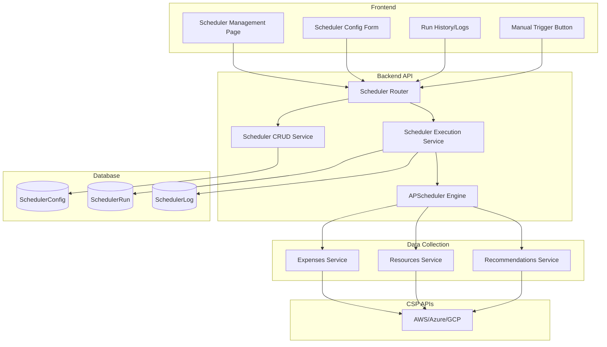
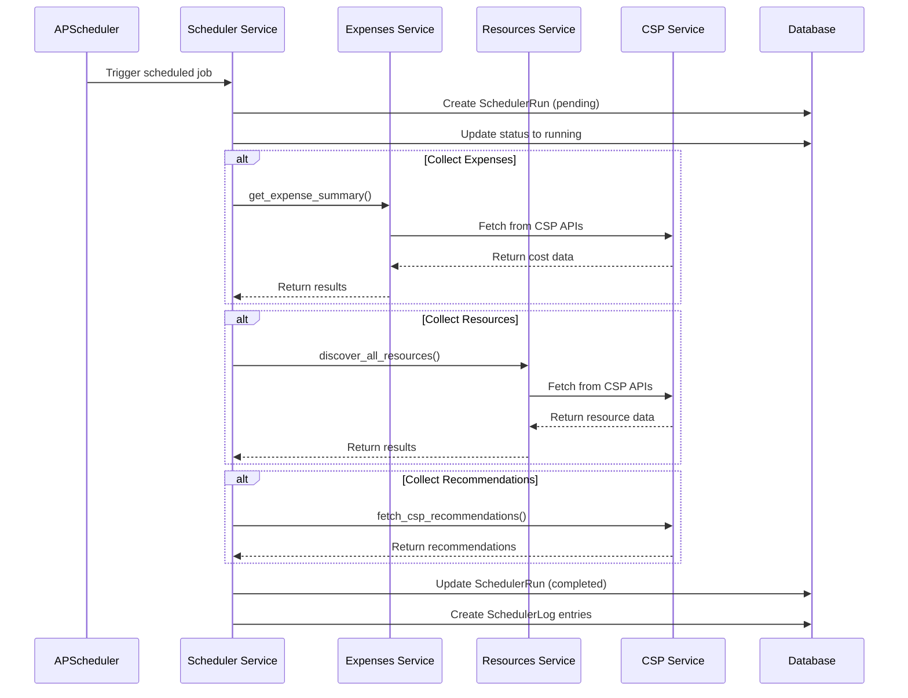

# Custom Scheduler Implementation Plan

## Overview
Implement a flexible, user-configurable scheduler system that allows organizations to schedule automatic data pulling from Cloud Service Providers (CSP) for:
- **Expenses** - Cost data aggregation
- **Resources** - Resource discovery and inventory
- **Recommendations** - Cost optimization recommendations

## Architecture



## Data Models

### SchedulerConfig
Stores user-defined scheduler configurations per organization.

```python
class SchedulerConfig(BaseModel):
    __tablename__ = "scheduler_configs"
    
    id: Mapped[str] = mapped_column(String(36), primary_key=True)
    organization_id: Mapped[str] = mapped_column(ForeignKey("organizations.id"), index=True)
    name: Mapped[str] = mapped_column(String(256), nullable=False)
    
    # Data types to collect (users can enable/disable each)
    collect_expenses: Mapped[bool] = mapped_column(Boolean, default=True)
    collect_resources: Mapped[bool] = mapped_column(Boolean, default=True)
    collect_recommendations: Mapped[bool] = mapped_column(Boolean, default=True)
    
    # Schedule configuration
    schedule_type: Mapped[str] = mapped_column(String(20), default="interval")  # interval, cron, once
    interval_minutes: Mapped[int | None] = mapped_column(Integer, nullable=True)  # for interval type
    cron_expression: Mapped[str | None] = mapped_column(String(100), nullable=True)  # for cron type
    
    # Timing options
    timezone: Mapped[str] = mapped_column(String(50), default="UTC")
    start_date: Mapped[datetime | None] = mapped_column(DateTime, nullable=True)
    end_date: Mapped[datetime | None] = mapped_column(DateTime, nullable=True)
    
    # Status
    is_enabled: Mapped[bool] = mapped_column(Boolean, default=True)
    
    # Audit
    created_at: Mapped[datetime] = mapped_column(DateTime, default=func.now())
    updated_at: Mapped[datetime] = mapped_column(DateTime, default=func.now(), onupdate=func.now())
    created_by: Mapped[str] = mapped_column(String(36), ForeignKey("users.id"))
```

### SchedulerRun
Tracks each execution of a scheduler.

```python
class SchedulerRun(BaseModel):
    __tablename__ = "scheduler_runs"
    
    id: Mapped[str] = mapped_column(String(36), primary_key=True)
    scheduler_config_id: Mapped[str] = mapped_column(ForeignKey("scheduler_configs.id"), index=True)
    organization_id: Mapped[str] = mapped_column(ForeignKey("organizations.id"), index=True)
    
    # Execution details
    started_at: Mapped[datetime] = mapped_column(DateTime, default=func.now())
    completed_at: Mapped[datetime | None] = mapped_column(DateTime, nullable=True)
    
    # Status: pending, running, completed, failed, cancelled
    status: Mapped[str] = mapped_column(String(20), default="pending")
    
    # What was collected
    collected_expenses: Mapped[bool] = mapped_column(Boolean, default=False)
    collected_resources: Mapped[bool] = mapped_column(Boolean, default=False)
    collected_recommendations: Mapped[bool] = mapped_column(Boolean, default=False)
    
    # Results
    records_processed: Mapped[int] = mapped_column(Integer, default=0)
    records_failed: Mapped[int] = mapped_column(Integer, default=0)
    error_message: Mapped[str | None] = mapped_column(Text, nullable=True)
    
    # Trigger type: scheduled, manual
    trigger_type: Mapped[str] = mapped_column(String(20), default="scheduled")
    triggered_by: Mapped[str | None] = mapped_column(String(36), ForeignKey("users.id"), nullable=True)
```

### SchedulerLog
Detailed logs for each scheduler run.

```python
class SchedulerLog(BaseModel):
    __tablename__ = "scheduler_logs"
    
    id: Mapped[str] = mapped_column(String(36), primary_key=True)
    scheduler_run_id: Mapped[str] = mapped_column(ForeignKey("scheduler_runs.id"), index=True)
    
    logged_at: Mapped[datetime] = mapped_column(DateTime, default=func.now())
    level: Mapped[str] = mapped_column(String(10))  # INFO, WARNING, ERROR
    message: Mapped[str] = mapped_column(Text)
    
    # Additional context
    data_type: Mapped[str | None] = mapped_column(String(20), nullable=True)  # expenses, resources, recommendations
    cloud_account_id: Mapped[str | None] = mapped_column(String(36), nullable=True)
    details: Mapped[dict | None] = mapped_column(JSON, nullable=True)
```

## API Endpoints

### Scheduler Management

| Method | Endpoint | Description |
|--------|----------|-------------|
| GET | `/api/v1/organizations/{org_id}/schedulers` | List all schedulers for org |
| POST | `/api/v1/organizations/{org_id}/schedulers` | Create new scheduler |
| GET | `/api/v1/organizations/{org_id}/schedulers/{id}` | Get scheduler details |
| PATCH | `/api/v1/organizations/{org_id}/schedulers/{id}` | Update scheduler |
| DELETE | `/api/v1/organizations/{org_id}/schedulers/{id}` | Delete scheduler |
| POST | `/api/v1/organizations/{org_id}/schedulers/{id}/toggle` | Enable/disable scheduler |
| POST | `/api/v1/organizations/{org_id}/schedulers/{id}/trigger` | Manual trigger |

### Scheduler Monitoring

| Method | Endpoint | Description |
|--------|----------|-------------|
| GET | `/api/v1/organizations/{org_id}/schedulers/{id}/runs` | Get run history |
| GET | `/api/v1/organizations/{org_id}/schedulers/{id}/runs/{run_id}` | Get run details |
| GET | `/api/v1/organizations/{org_id}/schedulers/{id}/runs/{run_id}/logs` | Get run logs |
| GET | `/api/v1/organizations/{org_id}/scheduler-stats` | Get overall stats |

## Frontend Components

### Pages
1. **Scheduler Management Page** (`/schedulers`)
   - List all schedulers
   - Create/Edit/Delete schedulers
   - Enable/Disable toggle
   - Manual trigger button
   - Quick stats view

2. **Scheduler Detail Page** (`/schedulers/{id}`)
   - Configuration view
   - Run history table
   - Log viewer
   - Performance charts

### Components
- `SchedulerCard` - Display scheduler with status
- `SchedulerForm` - Create/edit form with validation
- `SchedulerRunTable` - Run history with filtering
- `SchedulerLogViewer` - Collapsible log view
- `SchedulerStats` - Mini dashboard widget

## Schedule Types

### 1. Interval Scheduling
Run every X minutes/hours/days.
- Example: Every 30 minutes, Every 6 hours, Every day

### 2. Cron Scheduling
Flexible cron expressions.
- Example: `0 9 * * 1-5` (9 AM weekdays)
- Example: `0 */6 * * *` (every 6 hours)

### 3. One-Time
Run once at a specific date/time.
- Example: Run at 2025-01-01 00:00:00

## Data Collection Flow



## File Structure

```
backend/
├── app/
│   ├── scheduler/
│   │   ├── __init__.py
│   │   ├── models.py          # SchedulerConfig, SchedulerRun, SchedulerLog
│   │   ├── schemas.py         # Pydantic schemas
│   │   ├── router.py          # API endpoints
│   │   ├── service.py         # CRUD operations
│   │   ├── executor.py        # APScheduler integration & execution logic
│   │   └── enums.py           # Status enums, schedule types
│   └── main.py                # Add scheduler router
├── alembic/versions/          # Migration file
└── tests/
    └── scheduler/
        ├── test_service.py
        └── test_router.py

frontend/
├── src/
│   ├── api/
│   │   └── scheduler.ts       # API client functions
│   ├── types/
│   │   └── scheduler.ts       # TypeScript interfaces
│   ├── pages/
│   │   ├── Schedulers.tsx     # List page
│   │   └── SchedulerDetail.tsx # Detail page
│   └── components/
│       └── scheduler/
│           ├── SchedulerCard.tsx
│           ├── SchedulerForm.tsx
│           ├── SchedulerRunTable.tsx
│           └── SchedulerLogViewer.tsx
```

## Implementation Phases

### Phase 1: Backend Foundation
1. Create database models
2. Create Alembic migration
3. Implement APScheduler integration
4. Create executor service
5. Create CRUD service
6. Create API router
7. Add to FastAPI app

### Phase 2: Frontend Foundation
1. Create TypeScript types
2. Create API layer
3. Create base components
4. Create list page
5. Create detail page

### Phase 3: Advanced Features
1. Add cron expression builder UI
2. Add real-time status updates (WebSocket/SSE)
3. Add email notifications on failure
4. Add retry logic for failed runs

### Phase 4: Testing & Documentation
1. Unit tests for services
2. Integration tests for API
3. Frontend component tests
4. Documentation

## Key Dependencies

### Backend
```toml
# Add to pyproject.toml
apscheduler = "^3.10.4"
```

### Frontend
No new dependencies required (using existing stack).

## Security Considerations

1. **Organization Isolation** - Schedulers are scoped to organizations
2. **Permission Checks** - Only org admins can create/modify schedulers
3. **Rate Limiting** - Prevent abuse of manual trigger endpoint
4. **Audit Logging** - All scheduler actions logged
5. **Credential Security** - No CSP credentials stored in scheduler tables

## Error Handling

1. **Partial Failure** - If one data type fails, continue with others
2. **Retry Logic** - Exponential backoff for transient failures
3. **Alerting** - Email notification on consecutive failures
4. **Circuit Breaker** - Stop scheduler after N consecutive failures

## Performance Considerations

1. **Concurrent Execution** - Run data type collection in parallel
2. **Database Indexing** - Index on org_id, status, created_at
3. **Log Retention** - Auto-delete old logs (configurable retention)
4. **Run History** - Archive old runs after 90 days
