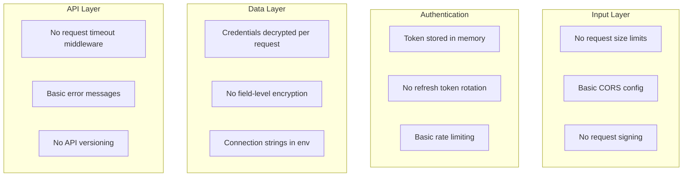

# CostPilot Security Enhancement Plan

## Executive Summary

This plan provides detailed security improvements for the CostPilot platform, focusing on code-level security vulnerabilities, secure coding practices, and protection against common attack vectors.

---

## 1. CODE SECURITY ANALYSIS

### 1.1 Current Security Posture

| Component | Current State | Risk Level |
|-----------|--------------|------------|
| JWT Authentication | Basic implementation with session binding | Medium |
| Encryption | Fernet symmetric encryption for credentials | Medium |
| Rate Limiting | IP-based in-memory limiter (auth only) | High |
| Input Validation | Schema-based validation via Pydantic | Low-Medium |
| SQL Injection | SQLAlchemy ORM (parameterized queries) | Low |
| XSS Protection | React auto-escaping + CSP headers | Low |
| Audit Logging | Security event logging implemented | Good |

### 1.2 Security Gaps Identified



---

## 2. SECURITY ENHANCEMENT DETAILED PLAN

### 2.1 Input Validation & Sanitization

#### 2.1.1 Strict Input Validation Middleware

```python
# app/middleware/validation.py
from fastapi import Request, HTTPException
from starlette.middleware.base import BaseHTTPMiddleware
import json

MAX_REQUEST_SIZE = 10 * 1024 * 1024  # 10MB
ALLOWED_CONTENT_TYPES = {"application/json", "multipart/form-data", "text/plain"}

class InputValidationMiddleware(BaseHTTPMiddleware):
    """Validate and sanitize all incoming requests."""
    
    async def dispatch(self, request: Request, call_next):
        # 1. Request size validation
        content_length = request.headers.get("content-length")
        if content_length and int(content_length) > MAX_REQUEST_SIZE:
            raise HTTPException(status_code=413, detail="Request too large")
        
        # 2. Content-Type validation
        content_type = request.headers.get("content-type", "").split(";")[0]
        if request.method in ["POST", "PUT", "PATCH"] and content_type not in ALLOWED_CONTENT_TYPES:
            raise HTTPException(status_code=415, detail="Unsupported media type")
        
        # 3. Path traversal prevention
        path = request.url.path
        if ".." in path or "%" in path:
            raise HTTPException(status_code=400, detail="Invalid path")
        
        response = await call_next(request)
        return response
```

**Implementation Tasks:**
- [ ] Create `app/middleware/validation.py` with input validation middleware
- [ ] Add configurable request size limits in [`config.py`](backend/app/config.py:1)
- [ ] Register middleware in [`main.py`](backend/app/main.py:1)
- [ ] Add unit tests for validation scenarios

#### 2.1.2 Enhanced Schema Validation

```python
# app/shared/validators.py
import re
from pydantic import validator, Field
from datetime import datetime

# Security-focused validators

def validate_no_html(value: str) -> str:
    """Prevent HTML injection in string fields."""
    if re.search(r'<[^>]+>', value):
        raise ValueError("HTML tags are not allowed")
    return value

def validate_safe_filename(filename: str) -> str:
    """Prevent path traversal in filenames."""
    dangerous_patterns = ['..', '/', '\\', '\x00', '%']
    if any(pattern in filename for pattern in dangerous_patterns):
        raise ValueError("Invalid filename")
    return filename

def validate_uuid_format(value: str) -> str:
    """Validate UUID v4 format."""
    pattern = r'^[0-9a-f]{8}-[0-9a-f]{4}-4[0-9a-f]{3}-[89ab][0-9a-f]{3}-[0-9a-f]{12}$'
    if not re.match(pattern, value, re.IGNORECASE):
        raise ValueError("Invalid UUID format")
    return value

# Apply to existing schemas
class SecureBaseSchema:
    """Base schema with security validators."""
    
    @validator('*', pre=True)
    def sanitize_strings(cls, v):
        if isinstance(v, str):
            # Remove null bytes
            v = v.replace('\x00', '')
            # Normalize unicode
            v = v.strip()
        return v
```

**Implementation Tasks:**
- [ ] Create `app/shared/validators.py` with security validators
- [ ] Update all schema files to use security validators
- [ ] Add HTML injection prevention to text fields
- [ ] Implement filename sanitization for file uploads

### 2.2 Authentication & Authorization Security

#### 2.2.1 Secure Token Management

```python
# app/auth/token_manager.py
import secrets
import hashlib
from datetime import datetime, timedelta
from typing import Optional
import redis.asyncio as redis
from app.config import settings

class SecureTokenManager:
    """Manage secure token lifecycle with rotation and revocation."""
    
    def __init__(self):
        self.redis: Optional[redis.Redis] = None
        self._refresh_token_rotation = True
        self._access_token_ttl = 15 * 60  # 15 minutes
        self._refresh_token_ttl = 7 * 24 * 60 * 60  # 7 days
    
    async def create_token_pair(self, user_id: str, session_id: str) -> dict:
        """Create access and refresh token pair."""
        access_token = self._generate_access_token(user_id, session_id)
        refresh_token = self._generate_refresh_token(user_id, session_id)
        
        # Store refresh token hash for revocation capability
        token_hash = hashlib.sha256(refresh_token.encode()).hexdigest()
        await self._store_refresh_token(user_id, session_id, token_hash)
        
        return {
            "access_token": access_token,
            "refresh_token": refresh_token,
            "token_type": "bearer",
            "expires_in": self._access_token_ttl
        }
    
    async def rotate_refresh_token(self, refresh_token: str) -> dict:
        """Rotate refresh token on use (detect reuse = potential theft)."""
        token_hash = hashlib.sha256(refresh_token.encode()).hexdigest()
        
        # Check if token was already used (potential replay attack)
        stored = await self._get_stored_token(token_hash)
        if not stored:
            # Token reuse detected - revoke all tokens for this user
            await self._revoke_all_user_tokens(stored["user_id"])
            raise SecurityException("Token reuse detected. All sessions revoked.")
        
        # Generate new pair and invalidate old refresh token
        new_pair = await self.create_token_pair(stored["user_id"], stored["session_id"])
        await self._invalidate_refresh_token(token_hash)
        
        return new_pair
    
    async def revoke_all_user_sessions(self, user_id: str) -> int:
        """Revoke all sessions for a user (password change, suspicious activity)."""
        pattern = f"session:{user_id}:*"
        keys = await self.redis.keys(pattern)
        if keys:
            await self.redis.delete(*keys)
        return len(keys)
```

**Implementation Tasks:**
- [ ] Create `app/auth/token_manager.py` with secure token management
- [ ] Implement refresh token rotation to prevent replay attacks
- [ ] Add token family tracking for theft detection
- [ ] Update [`auth/service.py`](backend/app/auth/service.py:1) to use new token manager
- [ ] Add Redis dependency for token storage

#### 2.2.2 Enhanced Session Security

```python
# app/auth/session_security.py
from fastapi import Request, HTTPException
import hashlib
import hmac
from app.config import settings

class SessionSecurityValidator:
    """Additional session security checks."""
    
    def __init__(self):
        self.max_session_age = 24 * 60 * 60  # 24 hours
        self.require_ip_binding = True
        self.require_user_agent_binding = True
    
    def generate_session_fingerprint(self, request: Request) -> str:
        """Generate unique fingerprint for session binding."""
        components = [
            request.client.host if request.client else "",
            request.headers.get("user-agent", ""),
            request.headers.get("accept-language", ""),
        ]
        fingerprint = "|".join(components)
        return hashlib.sha256(fingerprint.encode()).hexdigest()[:32]
    
    def validate_session_binding(
        self, 
        request: Request, 
        stored_fingerprint: str,
        stored_ip: str | None = None
    ) -> bool:
        """Validate session hasn't been hijacked."""
        current_fingerprint = self.generate_session_fingerprint(request)
        current_ip = request.client.host if request.client else None
        
        # Allow minor UA changes but require IP match
        if stored_ip and current_ip != stored_ip:
            # Check if IPs are from same /24 subnet
            if not self._ips_in_same_subnet(stored_ip, current_ip):
                return False
        
        # Fingerprint should match exactly
        if not hmac.compare_digest(stored_fingerprint, current_fingerprint):
            return False
        
        return True
    
    def _ips_in_same_subnet(self, ip1: str, ip2: str) -> bool:
        """Check if IPs are in the same /24 subnet."""
        try:
            parts1 = ip1.split(".")
            parts2 = ip2.split(".")
            return parts1[:3] == parts2[:3]
        except:
            return False
```

**Implementation Tasks:**
- [ ] Create `app/auth/session_security.py` with session binding validation
- [ ] Integrate with existing [`auth/dependencies.py`](backend/app/auth/dependencies.py:1)
- [ ] Update [`auth/security_logger.py`](backend/app/auth/security_logger.py:1) to log binding mismatches
- [ ] Add configuration options for binding strictness

### 2.3 Data Encryption & Protection

#### 2.3.1 Field-Level Encryption for PII

```python
# app/shared/field_encryption.py
from cryptography.fernet import Fernet
from cryptography.hazmat.primitives import hashes
from cryptography.hazmat.primitives.kdf.pbkdf2 import PBKDF2HMAC
import base64
import json
from typing import Any

class FieldEncryption:
    """Field-level encryption for sensitive data."""
    
    def __init__(self, master_key: bytes):
        self.master_key = master_key
        self._field_keys = {}
    
    def _derive_key(self, field_name: str) -> Fernet:
        """Derive unique key per field for isolation."""
        if field_name not in self._field_keys:
            kdf = PBKDF2HMAC(
                algorithm=hashes.SHA256(),
                length=32,
                salt=field_name.encode(),
                iterations=100000,
            )
            key = base64.urlsafe_b64encode(kdf.derive(self.master_key))
            self._field_keys[field_name] = Fernet(key)
        return self._field_keys[field_name]
    
    def encrypt_field(self, field_name: str, value: str) -> str:
        """Encrypt a single field value."""
        if not value:
            return value
        fernet = self._derive_key(field_name)
        return fernet.encrypt(value.encode()).decode()
    
    def decrypt_field(self, field_name: str, encrypted: str) -> str:
        """Decrypt a single field value."""
        if not encrypted:
            return encrypted
        fernet = self._derive_key(field_name)
        return fernet.decrypt(encrypted.encode()).decode()
    
    def encrypt_dict(self, data: dict[str, Any], sensitive_fields: list[str]) -> dict[str, Any]:
        """Encrypt specific fields in a dictionary."""
        result = data.copy()
        for field in sensitive_fields:
            if field in result and result[field]:
                result[field] = self.encrypt_field(field, str(result[field]))
        return result

# Usage in models
PII_FIELDS = ["email", "phone", "address", "tax_id"]

class EncryptedMixin:
    """Mixin for models with encrypted fields."""
    
    @property
    def decrypted_email(self) -> str | None:
        """Access decrypted email."""
        if hasattr(self, 'email_encrypted') and self.email_encrypted:
            return field_encryption.decrypt_field('email', self.email_encrypted)
        return None
```

**Implementation Tasks:**
- [ ] Create `app/shared/field_encryption.py` for field-level encryption
- [ ] Identify all PII fields in the database schema
- [ ] Create migration to add encrypted columns
- [ ] Update models to use encrypted fields
- [ ] Add decryption properties for safe access

#### 2.3.2 Secure Credential Caching

```python
# app/cloud_accounts/credential_cache.py
import asyncio
import hashlib
from datetime import datetime, timedelta
from typing import Optional
import redis.asyncio as redis
from app.shared.crypto import decrypt

class SecureCredentialCache:
    """Cache decrypted credentials securely with automatic rotation."""
    
    def __init__(self):
        self._cache: dict[str, dict] = {}
        self._lock = asyncio.Lock()
        self._ttl_seconds = 300  # 5 minutes
        self._redis: Optional[redis.Redis] = None
    
    def _get_cache_key(self, account_id: str) -> str:
        """Generate secure cache key."""
        return hashlib.sha256(f"cred:{account_id}".encode()).hexdigest()
    
    async def get_credentials(self, account_id: str, encrypted_config: str) -> dict:
        """Get cached credentials or decrypt fresh."""
        cache_key = self._get_cache_key(account_id)
        
        async with self._lock:
            # Check memory cache
            cached = self._cache.get(cache_key)
            if cached and cached["expires_at"] > datetime.utcnow():
                return cached["credentials"]
            
            # Check Redis cache (distributed)
            if self._redis:
                redis_cached = await self._redis.get(f"creds:{cache_key}")
                if redis_cached:
                    # Found in Redis, update memory cache
                    creds = json.loads(redis_cached)
                    self._cache[cache_key] = {
                        "credentials": creds,
                        "expires_at": datetime.utcnow() + timedelta(seconds=self._ttl_seconds)
                    }
                    return creds
            
            # Decrypt fresh
            credentials = json.loads(decrypt(encrypted_config))
            
            # Cache decrypted credentials
            await self._cache_credentials(cache_key, credentials)
            
            return credentials
    
    async def _cache_credentials(self, cache_key: str, credentials: dict):
        """Cache credentials securely."""
        expires_at = datetime.utcnow() + timedelta(seconds=self._ttl_seconds)
        
        async with self._lock:
            self._cache[cache_key] = {
                "credentials": credentials,
                "expires_at": expires_at
            }
            
            # Also cache in Redis with shorter TTL
            if self._redis:
                await self._redis.setex(
                    f"creds:{cache_key}",
                    self._ttl_seconds,
                    json.dumps(credentials)
                )
    
    async def invalidate(self, account_id: str):
        """Invalidate credentials for an account."""
        cache_key = self._get_cache_key(account_id)
        
        async with self._lock:
            self._cache.pop(cache_key, None)
            if self._redis:
                await self._redis.delete(f"creds:{cache_key}")
```

**Implementation Tasks:**
- [ ] Create `app/cloud_accounts/credential_cache.py`
- [ ] Update all CSP adapters to use credential cache
- [ ] Implement automatic cache invalidation on credential update
- [ ] Add cache metrics and monitoring

### 2.4 API Security Hardening

#### 2.4.1 Comprehensive Rate Limiting

```python
# app/middleware/rate_limiter.py
from fastapi import Request, HTTPException
from starlette.middleware.base import BaseHTTPMiddleware
import redis.asyncio as redis
import time
from enum import Enum

class RateLimitTier(Enum):
    """Different rate limit tiers for different endpoint types."""
    PUBLIC = {"requests": 30, "window": 60}      # 30/min for public endpoints
    AUTHENTICATED = {"requests": 100, "window": 60}  # 100/min for auth users
    EXPENSIVE = {"requests": 10, "window": 60}   # 10/min for expensive ops
    EXPORT = {"requests": 5, "window": 300}      # 5/5min for exports
    WEBHOOK = {"requests": 1000, "window": 60}   # 1000/min for webhooks

class RedisRateLimiter:
    """Distributed rate limiting using Redis with sliding window."""
    
    def __init__(self, redis_client: redis.Redis):
        self.redis = redis_client
    
    async def is_allowed(
        self, 
        key: str, 
        tier: RateLimitTier,
        burst: int = 0
    ) -> tuple[bool, dict]:
        """Check if request is allowed using sliding window."""
        now = time.time()
        window = tier.value["window"]
        limit = tier.value["requests"] + burst
        
        pipe = self.redis.pipeline()
        
        # Remove old entries outside window
        pipe.zremrangebyscore(key, 0, now - window)
        
        # Count current requests in window
        pipe.zcard(key)
        
        # Add current request
        pipe.zadd(key, {str(now): now})
        
        # Set expiry on the key
        pipe.expire(key, window)
        
        results = await pipe.execute()
        current_count = results[1]
        
        allowed = current_count <= limit
        
        # Get retry after if not allowed
        retry_after = 0
        if not allowed:
            oldest = await self.redis.zrange(key, 0, 0, withscores=True)
            if oldest:
                retry_after = int(oldest[0][1] + window - now)
        
        return allowed, {
            "limit": limit,
            "remaining": max(0, limit - current_count),
            "reset": int(now + window),
            "retry_after": retry_after
        }

class RateLimitMiddleware(BaseHTTPMiddleware):
    """Apply rate limiting based on endpoint and user."""
    
    async def dispatch(self, request: Request, call_next):
        # Determine rate limit tier based on path
        tier = self._get_tier_for_path(request.url.path)
        
        # Generate rate limit key
        key = await self._generate_key(request)
        
        # Check rate limit
        allowed, headers = await self.limiter.is_allowed(key, tier)
        
        if not allowed:
            raise HTTPException(
                status_code=429,
                detail="Rate limit exceeded",
                headers={
                    "Retry-After": str(headers["retry_after"]),
                    "X-RateLimit-Limit": str(headers["limit"]),
                    "X-RateLimit-Remaining": "0",
                    "X-RateLimit-Reset": str(headers["reset"])
                }
            )
        
        response = await call_next(request)
        
        # Add rate limit headers to response
        response.headers["X-RateLimit-Limit"] = str(headers["limit"])
        response.headers["X-RateLimit-Remaining"] = str(headers["remaining"])
        response.headers["X-RateLimit-Reset"] = str(headers["reset"])
        
        return response
    
    def _get_tier_for_path(self, path: str) -> RateLimitTier:
        """Determine rate limit tier based on endpoint path."""
        if "/export" in path:
            return RateLimitTier.EXPORT
        elif "/webhook" in path:
            return RateLimitTier.WEBHOOK
        elif any(x in path for x in ["/recommendations", "/csp/"]):
            return RateLimitTier.EXPENSIVE
        elif path.startswith("/api/v1/auth"):
            return RateLimitTier.PUBLIC
        else:
            return RateLimitTier.AUTHENTICATED
```

**Implementation Tasks:**
- [ ] Create `app/middleware/rate_limiter.py` with Redis-backed rate limiting
- [ ] Define rate limit tiers for different endpoint types
- [ ] Replace existing [`auth/rate_limit.py`](backend/app/auth/rate_limit.py:1)
- [ ] Add per-organization rate limiting
- [ ] Implement burst capacity for legitimate traffic spikes

#### 2.4.2 Request Timeout & Resource Protection

```python
# app/middleware/timeout.py
import asyncio
from fastapi import Request
from starlette.middleware.base import BaseHTTPMiddleware
from starlette.responses import JSONResponse

class TimeoutMiddleware(BaseHTTPMiddleware):
    """Enforce request timeouts to prevent resource exhaustion."""
    
    def __init__(self, app, default_timeout: float = 30.0):
        super().__init__(app)
        self.default_timeout = default_timeout
        self.endpoint_timeouts = {
            "/api/v1/organizations": 10.0,
            "/api/v1/expenses": 45.0,  # Cost data can take longer
            "/api/v1/resources": 60.0,  # Resource discovery
            "/api/v1/recommendations": 30.0,
            "/api/v1/export": 300.0,  # Exports can take longer
        }
    
    async def dispatch(self, request: Request, call_next):
        timeout = self._get_timeout_for_path(request.url.path)
        
        try:
            return await asyncio.wait_for(
                call_next(request),
                timeout=timeout
            )
        except asyncio.TimeoutError:
            return JSONResponse(
                status_code=504,
                content={
                    "error": "Request timeout",
                    "detail": f"Request exceeded {timeout} seconds",
                    "code": "REQUEST_TIMEOUT"
                }
            )
    
    def _get_timeout_for_path(self, path: str) -> float:
        """Get appropriate timeout for endpoint."""
        for prefix, timeout in self.endpoint_timeouts.items():
            if path.startswith(prefix):
                return timeout
        return self.default_timeout
```

**Implementation Tasks:**
- [ ] Create `app/middleware/timeout.py` with configurable timeouts
- [ ] Register middleware in [`main.py`](backend/app/main.py:1)
- [ ] Define timeout values per endpoint type
- [ ] Add graceful cancellation for timed-out operations

### 2.5 Audit & Security Monitoring

#### 2.5.1 Comprehensive Audit Logging

```python
# app/security/audit_logger.py
from datetime import datetime
from enum import Enum, auto
from typing import Any, Optional
import json
from sqlalchemy.ext.asyncio import AsyncSession

class AuditEventType(Enum):
    """Types of auditable events."""
    # Authentication
    LOGIN_SUCCESS = auto()
    LOGIN_FAILURE = auto()
    LOGOUT = auto()
    TOKEN_REFRESH = auto()
    PASSWORD_CHANGE = auto()
    MFA_ENABLED = auto()
    
    # Authorization
    PERMISSION_DENIED = auto()
    ROLE_ASSIGNED = auto()
    ROLE_REVOKED = auto()
    
    # Data Access
    DATA_EXPORTED = auto()
    DATA_IMPORTED = auto()
    RECORD_VIEWED = auto()
    RECORD_MODIFIED = auto()
    RECORD_DELETED = auto()
    
    # Admin Actions
    USER_CREATED = auto()
    USER_SUSPENDED = auto()
    USER_REMOVED = auto()
    ORG_SETTINGS_CHANGED = auto()
    
    # Security
    SUSPICIOUS_ACTIVITY = auto()
    RATE_LIMIT_EXCEEDED = auto()
    SESSION_INVALIDATED = auto()

class AuditLogger:
    """Comprehensive audit logging for security events."""
    
    SENSITIVE_FIELDS = {'password', 'secret', 'token', 'key', 'credential'}
    
    async def log(
        self,
        db: AsyncSession,
        event_type: AuditEventType,
        user_id: Optional[str] = None,
        org_id: Optional[str] = None,
        resource_type: Optional[str] = None,
        resource_id: Optional[str] = None,
        action_details: Optional[dict] = None,
        ip_address: Optional[str] = None,
        user_agent: Optional[str] = None,
        success: bool = True,
        severity: str = "info"
    ):
        """Log a security audit event."""
        
        # Sanitize action details
        sanitized_details = self._sanitize_details(action_details or {})
        
        event = {
            "timestamp": datetime.utcnow().isoformat(),
            "event_type": event_type.name,
            "user_id": user_id,
            "organization_id": org_id,
            "resource_type": resource_type,
            "resource_id": resource_id,
            "action_details": sanitized_details,
            "ip_address": self._hash_ip(ip_address),
            "user_agent": user_agent,
            "success": success,
            "severity": severity,
        }
        
        # Write to database
        await self._persist_event(db, event)
        
        # Alert on high severity events
        if severity in ["high", "critical"]:
            await self._send_security_alert(event)
    
    def _sanitize_details(self, details: dict) -> dict:
        """Remove sensitive data from log details."""
        sanitized = {}
        for key, value in details.items():
            if any(sensitive in key.lower() for sensitive in self.SENSITIVE_FIELDS):
                sanitized[key] = "[REDACTED]"
            elif isinstance(value, dict):
                sanitized[key] = self._sanitize_details(value)
            else:
                sanitized[key] = value
        return sanitized
    
    def _hash_ip(self, ip: Optional[str]) -> Optional[str]:
        """Hash IP address for privacy."""
        if not ip:
            return None
        import hashlib
        return hashlib.sha256(ip.encode()).hexdigest()[:16]
    
    async def _send_security_alert(self, event: dict):
        """Send real-time alert for critical security events."""
        # Integration with notification service
        pass
```

**Implementation Tasks:**
- [ ] Create `app/security/audit_logger.py` with comprehensive audit logging
- [ ] Extend existing [`auth/security_logger.py`](backend/app/auth/security_logger.py:1)
- [ ] Add audit log entries for all sensitive operations
- [ ] Create audit log viewer API for admins
- [ ] Implement real-time security alerts

---

## 3. IMPLEMENTATION ROADMAP

### Phase 1: Critical Security Fixes (Week 1)
- [ ] Implement input validation middleware
- [ ] Add comprehensive rate limiting
- [ ] Deploy request timeout middleware
- [ ] Add field-level encryption for PII

### Phase 2: Authentication Hardening (Week 2)
- [ ] Implement secure token manager with rotation
- [ ] Add session binding validation
- [ ] Deploy credential caching
- [ ] Update security headers

### Phase 3: Audit & Monitoring (Week 3)
- [ ] Deploy comprehensive audit logging
- [ ] Implement security alerting
- [ ] Add audit log viewer UI
- [ ] Create security dashboard

### Phase 4: Advanced Security (Week 4)
- [ ] Implement API request signing
- [ ] Add CSP reporting
- [ ] Deploy HSTS preloading
- [ ] Security penetration testing

---

## 4. SECURITY CHECKLIST

### Input Validation
- [ ] Request size limits enforced
- [ ] Content-Type validation
- [ ] Path traversal prevention
- [ ] HTML injection prevention
- [ ] SQL injection prevention (ORM usage verified)

### Authentication
- [ ] Strong password policy
- [ ] MFA support implemented
- [ ] Token rotation working
- [ ] Session binding validated
- [ ] Concurrent session limits

### Authorization
- [ ] RBAC properly enforced
- [ ] Resource-level permissions
- [ ] ABAC policies evaluated
- [ ] API key scopes limited

### Data Protection
- [ ] Encryption at rest (database)
- [ ] Encryption in transit (TLS 1.3)
- [ ] Field-level encryption for PII
- [ ] Secure credential storage
- [ ] Key rotation procedures

### API Security
- [ ] Rate limiting per endpoint
- [ ] Request timeouts enforced
- [ ] CORS properly configured
- [ ] Security headers present
- [ ] Error messages sanitized

### Monitoring
- [ ] Audit logging enabled
- [ ] Failed login monitoring
- [ ] Anomaly detection
- [ ] Real-time alerting
- [ ] Log retention policy
