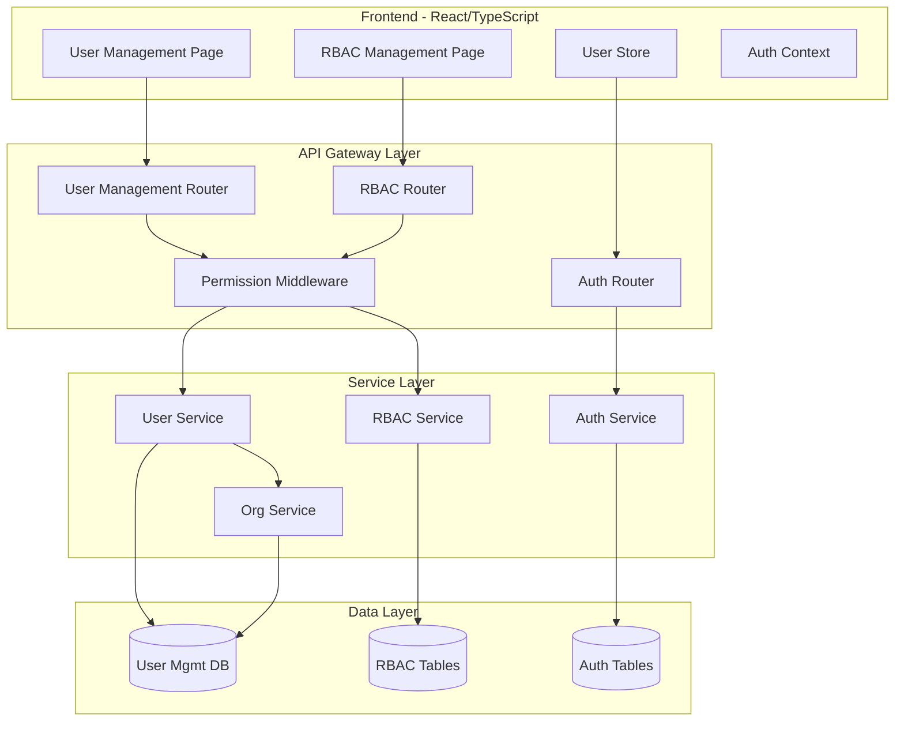

# User Access Control Implementation Plan

## Executive Summary

This plan outlines the implementation of a comprehensive User Access Control (UAC) system for CostPilot that integrates with the existing RBAC (Role-Based Access Control) enterprise module. The system will replace the current hardcoded users in the frontend with a full-featured, enterprise-grade user management solution.

## Current State Analysis

### Existing RBAC Infrastructure
The system already has a robust RBAC foundation in `backend/app/enterprise/modules/rbac/`:

- **Role Model**: [`Role`](backend/app/enterprise/modules/rbac/models.py:13), [`RolePermission`](backend/app/enterprise/modules/rbac/models.py:32)
- **User Assignment**: [`UserRoleAssignment`](backend/app/enterprise/modules/rbac/models.py:52)
- **ABAC Policies**: [`ABACPolicy`](backend/app/enterprise/modules/rbac/models.py:72) for attribute-based access
- **Access Reviews**: [`AccessReview`](backend/app/enterprise/modules/rbac/models.py:95)
- **SSO Integration**: [`SSOConfig`](backend/app/enterprise/modules/rbac/models.py:118)

### Current User Management
- **Auth System**: [`User`](backend/app/auth/models.py:10) model with email/password
- **Organization Link**: [`Employee`](backend/app/organizations/models.py:30) model links users to organizations
- **Legacy Roles**: [`RolePurpose`](backend/app/shared/enums.py:33) enum (MEMBER, ENGINEER, MANAGER)
- **Frontend**: [`Users.tsx`](frontend/src/pages/Users.tsx:1) has hardcoded mock users

### Gap Analysis
| Feature | Current | Required |
|---------|---------|----------|
| User listing | Hardcoded mock data | Dynamic from database |
| Role assignment | Simple enum | Full RBAC integration |
| User activation | Basic boolean | Multi-state lifecycle |
| Invite flow | Minimal | Full workflow with email |
| Permission visibility | None | Role-permission mapping |
| Bulk operations | None | Bulk invite, role change |
| Audit logging | None | Full user action audit |

---

## Architecture Overview



---

## Data Model Design

### Enhanced User Model

```python
# backend/app/user_management/models.py

class UserStatus(str, enum.Enum):
    PENDING = "pending"          # Invited, not yet accepted
    ACTIVE = "active"            # Normal active state
    SUSPENDED = "suspended"      # Temporarily disabled
    DEACTIVATED = "deactivated"  # Permanently disabled
    LOCKED = "locked"            # Auto-locked due to failed attempts

class UserInvitation(BaseModel):
    """Track pending user invitations"""
    __tablename__ = "user_invitations"
    
    email: Mapped[str] = mapped_column(String(256), nullable=False, index=True)
    organization_id: Mapped[str] = mapped_column(String(36), ForeignKey("organizations.id"))
    invited_by: Mapped[str] = mapped_column(String(36), ForeignKey("users.id"))
    role_id: Mapped[str | None] = mapped_column(String(36), ForeignKey("rbac_roles.id"))
    token: Mapped[str] = mapped_column(String(512), unique=True)
    expires_at: Mapped[datetime]
    accepted_at: Mapped[datetime | None]
    status: Mapped[InvitationStatus]  # pending, accepted, expired, cancelled

class UserActivityLog(BaseModel):
    """Audit trail for user actions"""
    __tablename__ = "user_activity_logs"
    
    user_id: Mapped[str] = mapped_column(String(36), ForeignKey("users.id"))
    organization_id: Mapped[str] = mapped_column(String(36), ForeignKey("organizations.id"))
    action: Mapped[str] = mapped_column(String(64))  # login, logout, role_changed, etc.
    resource_type: Mapped[str | None]
    resource_id: Mapped[str | None]
    ip_address: Mapped[str | None]
    user_agent: Mapped[str | None]
    metadata: Mapped[dict | None] = mapped_column(JSON)

class UserPreferences(BaseModel):
    """User-specific preferences"""
    __tablename__ = "user_preferences"
    
    user_id: Mapped[str] = mapped_column(String(36), ForeignKey("users.id"), unique=True)
    timezone: Mapped[str] = mapped_column(String(64), default="UTC")
    language: Mapped[str] = mapped_column(String(10), default="en")
    notification_settings: Mapped[dict] = mapped_column(JSON, default=dict)
    dashboard_layout: Mapped[dict | None] = mapped_column(JSON)
```

### Enhanced Employee Model Integration

```python
# Extend backend/app/organizations/models.py

class Employee(BaseModel):
    __tablename__ = "employees"
    
    name: Mapped[str] = mapped_column(String(256), nullable=False)
    organization_id: Mapped[str] = mapped_column(
        String(36), ForeignKey("organizations.id"), nullable=False
    )
    auth_user_id: Mapped[str] = mapped_column(
        String(36), ForeignKey("users.id"), nullable=False
    )
    # Remove old role field, use RBAC instead
    department: Mapped[str | None] = mapped_column(String(128))
    job_title: Mapped[str | None] = mapped_column(String(128))
    joined_at: Mapped[datetime] = mapped_column(default_factory=datetime.utcnow)
    
    # Relationships
    organization: Mapped["Organization"] = relationship("Organization", back_populates="employees")
    user: Mapped["User"] = relationship("User", back_populates="employees")
    role_assignments: Mapped[list["UserRoleAssignment"]] = relationship(
        "UserRoleAssignment", back_populates="employee", lazy="selectin"
    )
```

### RBAC Integration Model

```python
# Extend backend/app/enterprise/modules/rbac/models.py

class UserRoleAssignment(BaseModel):
    __tablename__ = "rbac_user_roles"
    
    user_id: Mapped[str] = mapped_column(String(36), ForeignKey("users.id"), nullable=False)
    employee_id: Mapped[str | None] = mapped_column(
        String(36), ForeignKey("employees.id"), nullable=True
    )
    role_id: Mapped[str] = mapped_column(String(36), ForeignKey("rbac_roles.id"), nullable=False)
    organization_id: Mapped[str] = mapped_column(
        String(36), ForeignKey("organizations.id"), nullable=False
    )
    assigned_by: Mapped[str] = mapped_column(String(36), ForeignKey("users.id"))
    assigned_at: Mapped[datetime] = mapped_column(default_factory=datetime.utcnow)
    expires_at: Mapped[datetime | None]  # For temporary access
    
    role: Mapped["Role"] = relationship("Role", lazy="selectin")
    employee: Mapped["Employee"] = relationship("Employee", back_populates="role_assignments")
```

---

## API Design

### User Management Endpoints

```yaml
# backend/app/user_management/router.py

GET    /organizations/{org_id}/users
       - List all users in organization with pagination, filtering, sorting
       - Query params: role, status, search, page, limit, sort_by, sort_order
       - Response: Paginated list with role assignments

GET    /organizations/{org_id}/users/{user_id}
       - Get detailed user information
       - Include: profile, roles, permissions, activity summary

POST   /organizations/{org_id}/users/invite
       - Invite new user by email
       - Body: { email, role_id, department, message }
       - Creates invitation, sends email

POST   /organizations/{org_id}/users/invite-bulk
       - Bulk invite multiple users
       - Body: { invitations: [{ email, role_id, department }] }

POST   /users/invitations/{token}/accept
       - Accept invitation and create account
       - Body: { display_name, password }

PATCH  /organizations/{org_id}/users/{user_id}
       - Update user details
       - Body: { name, department, job_title, is_active }

PATCH  /organizations/{org_id}/users/{user_id}/roles
       - Assign/revoke roles
       - Body: { role_ids: [], action: 'assign' | 'revoke' }

POST   /organizations/{org_id}/users/{user_id}/suspend
       - Temporarily suspend user
       - Body: { reason, duration_days }

POST   /organizations/{org_id}/users/{user_id}/activate
       - Reactivate suspended user

DELETE /organizations/{org_id}/users/{user_id}
       - Remove user from organization (soft delete)

GET    /organizations/{org_id}/users/{user_id}/activity
       - Get user activity log
       - Query params: from_date, to_date, action_type, page

GET    /organizations/{org_id}/users/{user_id}/permissions
       - Get effective permissions for user
       - Aggregates all role permissions + ABAC policies
```

### Enhanced RBAC Endpoints

```yaml
# Extend existing backend/app/enterprise/modules/rbac/router.py

GET    /organizations/{org_id}/rbac/users
       - List users with their role assignments
       - Aggregate view for RBAC management

GET    /organizations/{org_id}/rbac/users/{user_id}/effective-permissions
       - Calculate effective permissions for user
       - Combines RBAC roles + ABAC policies
       - Returns: { permissions: [], roles: [], policies: [] }

POST   /organizations/{org_id}/rbac/check
       - Check if user has specific permission
       - Body: { user_id, action, resource_type, resource_attributes }
```

### Schema Definitions

```python
# backend/app/user_management/schemas.py

class UserListItem(BaseModel):
    id: str
    email: str
    display_name: str
    status: UserStatus
    is_active: bool
    last_login: datetime | None
    roles: list[RoleSummary]
    department: str | None
    joined_at: datetime
    avatar_url: str | None

class UserDetail(UserListItem):
    job_title: str | None
    preferences: UserPreferences | None
    activity_summary: ActivitySummary
    permissions: list[PermissionEntry]

class UserInviteRequest(BaseModel):
    email: EmailStr
    role_id: str
    department: str | None = None
    job_title: str | None = None
    message: str | None = None

class UserInviteBulkRequest(BaseModel):
    invitations: list[UserInviteRequest]

class UserInviteResponse(BaseModel):
    id: str
    email: str
    status: str  # sent, failed
    invitation_token: str | None
    expires_at: datetime

class UserRoleUpdateRequest(BaseModel):
    role_ids: list[str]
    action: Literal["assign", "revoke", "replace"]
    reason: str | None = None

class UserActivityLogEntry(BaseModel):
    id: str
    action: str
    resource_type: str | None
    resource_id: str | None
    ip_address: str | None
    created_at: datetime
    metadata: dict | None

class UserActivityList(BaseModel):
    items: list[UserActivityLogEntry]
    total: int
    page: int
    limit: int

class EffectivePermissionsResponse(BaseModel):
    user_id: str
    organization_id: str
    roles: list[RoleSummary]
    permissions: list[PermissionEntry]
    abac_policies: list[ABACPolicySummary]
    calculated_at: datetime
```

---

## Frontend Design

### User Management Page Redesign

```typescript
// frontend/src/pages/Users.tsx - New Structure

interface UsersPage {
  // Main components
  UserList: Component  // Table with sorting, filtering
  UserDetail: Component  // Side panel or modal
  InviteModal: Component  // Single/bulk invite
  RoleAssignment: Component  // Role management
  ActivityLog: Component  // User activity viewer
}

// State management
interface UserState {
  users: User[];
  pagination: PaginationInfo;
  filters: UserFilters;
  selectedUser: User | null;
  loading: boolean;
}

// API integration
interface UserAPI {
  listUsers: (orgId: string, filters: UserFilters) => Promise<PaginatedUsers>;
  getUser: (orgId: string, userId: string) => Promise<UserDetail>;
  inviteUser: (orgId: string, data: InviteRequest) => Promise<InviteResponse>;
  updateUser: (orgId: string, userId: string, data: UpdateRequest) => Promise<User>;
  updateRoles: (orgId: string, userId: string, data: RoleUpdate) => Promise<void>;
  getActivity: (orgId: string, userId: string, params: ActivityParams) => Promise<ActivityLog>;
}
```

### Key UI Components

1. **User List Table**
   - Columns: Avatar, Name, Email, Roles (badges), Status, Last Active, Actions
   - Row actions: View, Edit, Suspend, Remove
   - Bulk actions: Invite, Change Role, Suspend, Remove
   - Filters: Role, Status, Department, Search
   - Sorting: All columns

2. **User Detail Panel**
   - Profile section with editable fields
   - Roles & Permissions tab
   - Activity History tab
   - Danger zone (suspend/remove)

3. **Invite Modal**
   - Single invite form (email, role, department)
   - Bulk invite (CSV upload or multiple emails)
   - Preview before send
   - Success/failure tracking

4. **Role Assignment Interface**
   - Visual role selector
   - Permission preview for each role
   - Effective permissions calculator

---

## Service Layer Implementation

### User Management Service

```python
# backend/app/user_management/service.py

class UserManagementService:
    
    async def list_organization_users(
        self,
        db: AsyncSession,
        org_id: str,
        filters: UserFilters,
        pagination: PaginationParams
    ) -> PaginatedResult[UserListItem]:
        """List users with role assignments and filtering"""
        pass
    
    async def invite_user(
        self,
        db: AsyncSession,
        org_id: str,
        invited_by: str,
        data: UserInviteRequest
    ) -> UserInvitation:
        """Create invitation and send email"""
        pass
    
    async def process_invitation(
        self,
        db: AsyncSession,
        token: str,
        data: InvitationAcceptData
    ) -> User:
        """Accept invitation and create user account"""
        pass
    
    async def update_user_roles(
        self,
        db: AsyncSession,
        org_id: str,
        user_id: str,
        data: UserRoleUpdateRequest,
        updated_by: str
    ) -> list[UserRoleAssignment]:
        """Update user role assignments with audit logging"""
        pass
    
    async def get_effective_permissions(
        self,
        db: AsyncSession,
        org_id: str,
        user_id: str
    ) -> EffectivePermissions:
        """Calculate effective permissions from all sources"""
        pass
    
    async def log_user_activity(
        self,
        db: AsyncSession,
        user_id: str,
        org_id: str,
        action: str,
        metadata: dict | None = None
    ) -> None:
        """Log user action to audit trail"""
        pass
```

### Permission Checking Integration

```python
# backend/app/user_management/dependencies.py

async def require_permission(
    action: PermissionAction,
    resource_type: RBACResourceType,
    org_id_param: str = "org_id"
):
    """Dependency factory for permission checking"""
    async def checker(
        request: Request,
        current_user: User = Depends(get_current_user),
        db: AsyncSession = Depends(get_db)
    ):
        org_id = request.path_params.get(org_id_param)
        
        # Check RBAC permission
        has_permission = await check_user_permission(
            db, org_id, current_user.id, action, resource_type
        )
        
        if not has_permission:
            raise ForbiddenError(f"Missing permission: {action} {resource_type}")
        
        return current_user
    
    return checker

# Usage in router:
@router.post(
    "/{org_id}/users/invite",
    dependencies=[Depends(require_permission(PermissionAction.CREATE, RBACResourceType.USER))]
)
async def invite_user(...):
    pass
```

---

## Database Migrations

### Migration 004: User Management Enhancement

```python
# backend/alembic/versions/004_add_user_management.py

"""
Add user management tables and enhance RBAC integration
"""

from alembic import op
import sqlalchemy as sa
from sqlalchemy.dialects import postgresql

revision = '004_add_user_management'
down_revision = '003_add_scheduler_tables'

def upgrade():
    # Add status field to users table
    op.add_column('users', sa.Column('status', sa.String(32), server_default='active'))
    op.add_column('users', sa.Column('failed_login_attempts', sa.Integer, server_default='0'))
    op.add_column('users', sa.Column('locked_until', sa.DateTime, nullable=True))
    
    # Create user_invitations table
    op.create_table(
        'user_invitations',
        sa.Column('id', sa.String(36), primary_key=True),
        sa.Column('email', sa.String(256), nullable=False, index=True),
        sa.Column('organization_id', sa.String(36), sa.ForeignKey('organizations.id'), nullable=False),
        sa.Column('invited_by', sa.String(36), sa.ForeignKey('users.id'), nullable=False),
        sa.Column('role_id', sa.String(36), sa.ForeignKey('rbac_roles.id'), nullable=True),
        sa.Column('token', sa.String(512), unique=True, nullable=False),
        sa.Column('status', sa.String(32), server_default='pending'),
        sa.Column('expires_at', sa.DateTime, nullable=False),
        sa.Column('accepted_at', sa.DateTime, nullable=True),
        sa.Column('created_at', sa.DateTime, server_default=sa.func.now()),
        sa.Column('deleted_at', sa.DateTime, nullable=True),
    )
    
    # Create user_activity_logs table
    op.create_table(
        'user_activity_logs',
        sa.Column('id', sa.String(36), primary_key=True),
        sa.Column('user_id', sa.String(36), sa.ForeignKey('users.id'), nullable=False),
        sa.Column('organization_id', sa.String(36), sa.ForeignKey('organizations.id'), nullable=False),
        sa.Column('action', sa.String(64), nullable=False),
        sa.Column('resource_type', sa.String(64), nullable=True),
        sa.Column('resource_id', sa.String(36), nullable=True),
        sa.Column('ip_address', sa.String(45), nullable=True),
        sa.Column('user_agent', sa.Text, nullable=True),
        sa.Column('metadata', postgresql.JSON(astext_type=sa.Text), nullable=True),
        sa.Column('created_at', sa.DateTime, server_default=sa.func.now()),
    )
    
    # Create indexes
    op.create_index('idx_user_activity_user_id', 'user_activity_logs', ['user_id'])
    op.create_index('idx_user_activity_org_id', 'user_activity_logs', ['organization_id'])
    op.create_index('idx_user_activity_created', 'user_activity_logs', ['created_at'])
    op.create_index('idx_user_invitations_token', 'user_invitations', ['token'])
    op.create_index('idx_user_invitations_email', 'user_invitations', ['email'])
    
    # Enhance employees table
    op.add_column('employees', sa.Column('department', sa.String(128), nullable=True))
    op.add_column('employees', sa.Column('job_title', sa.String(128), nullable=True))
    op.add_column('employees', sa.Column('joined_at', sa.DateTime, server_default=sa.func.now()))
    
    # Add assigned_by to rbac_user_roles
    op.add_column('rbac_user_roles', sa.Column('assigned_by', sa.String(36), sa.ForeignKey('users.id'), nullable=True))
    op.add_column('rbac_user_roles', sa.Column('assigned_at', sa.DateTime, server_default=sa.func.now()))
    op.add_column('rbac_user_roles', sa.Column('expires_at', sa.DateTime, nullable=True))

def downgrade():
    # Reverse all changes
    pass
```

---

## Security Considerations

### Authentication & Authorization

1. **Permission Enforcement**
   - All endpoints must check permissions via RBAC
   - Default deny: no access without explicit permission
   - Role hierarchy: MANAGE implies all other actions

2. **Invitation Security**
   - Tokens: Cryptographically secure random (32+ bytes)
   - Expiration: 7 days default, configurable
   - One-time use: Token invalidated after acceptance
   - Rate limiting: Max 5 invitations per hour per user

3. **Audit Logging**
   - Log all user management actions
   - Include: who, what, when, where (IP)
   - Immutable logs (append-only)
   - Retention: 90 days default, configurable

4. **Data Protection**
   - Email addresses encrypted at rest
   - Activity logs anonymized after retention period
   - GDPR compliance: Right to be forgotten support

### Access Patterns

| Action | Required Permission | Notes |
|--------|---------------------|-------|
| List users | `READ` on `USER` | Shows only active unless `MANAGE` permission |
| View user details | `READ` on `USER` | Full details with `MANAGE` permission |
| Invite user | `CREATE` on `USER` | Also requires `MANAGE` on target role |
| Update user | `UPDATE` on `USER` | Self-service for own profile always allowed |
| Change roles | `MANAGE` on `USER` | Or `MANAGE` on `ENTERPRISE` |
| Suspend/Activate | `MANAGE` on `USER` | Cannot suspend self or higher-privileged users |
| Remove user | `DELETE` on `USER` | Soft delete only, requires confirmation |
| View audit logs | `MANAGE` on `USER` | Users can view own activity |

---

## Implementation Phases

### Phase 1: Foundation (Week 1-2)
- [ ] Create database migration for new tables
- [ ] Implement backend models and schemas
- [ ] Create user management service layer
- [ ] Implement core API endpoints (list, get, update)
- [ ] Add permission checking dependencies

### Phase 2: Invitation System (Week 2-3)
- [ ] Implement invitation workflow
- [ ] Create email service for invitations
- [ ] Build invitation acceptance flow
- [ ] Add bulk invitation support
- [ ] Implement invitation management endpoints

### Phase 3: RBAC Integration (Week 3-4)
- [ ] Integrate with existing RBAC system
- [ ] Implement role assignment UI
- [ ] Add effective permissions calculator
- [ ] Create permission checking middleware
- [ ] Migrate existing Employee roles to RBAC

### Phase 4: Frontend Implementation (Week 4-5)
- [ ] Redesign Users page with real data
- [ ] Build user detail panel
- [ ] Create invite modal
- [ ] Implement role assignment interface
- [ ] Add activity log viewer

### Phase 5: Audit & Security (Week 5-6)
- [ ] Implement audit logging service
- [ ] Add activity log endpoints
- [ ] Create security features (lockout, session management)
- [ ] Add rate limiting for sensitive operations
- [ ] Implement data retention policies

### Phase 6: Testing & Polish (Week 6-7)
- [ ] Unit tests for all services
- [ ] Integration tests for API endpoints
- [ ] Frontend component tests
- [ ] End-to-end user flows
- [ ] Performance optimization
- [ ] Documentation updates

---

## Enterprise Features

### Advanced RBAC

1. **Hierarchical Roles**
   ```python
   class Role(BaseModel):
       # Add to existing Role model
       parent_id: Mapped[str | None] = mapped_column(ForeignKey("rbac_roles.id"))
       level: Mapped[int] = mapped_column(default=0)  # For hierarchy
       inherits_permissions: Mapped[bool] = mapped_column(default=True)
   ```

2. **Time-Based Access**
   ```python
   class UserRoleAssignment(BaseModel):
       # Extend existing
       effective_from: Mapped[datetime | None]
       effective_until: Mapped[datetime | None]
       schedule: Mapped[dict | None]  # Cron-like schedule
   ```

3. **Approval Workflows**
   ```python
   class AccessRequest(BaseModel):
       __tablename__ = "access_requests"
       
       user_id: Mapped[str]
       requested_role_id: Mapped[str]
       requested_by: Mapped[str]
       status: Mapped[RequestStatus]  # pending, approved, denied
       approver_id: Mapped[str | None]
       justification: Mapped[str]
       approved_at: Mapped[datetime | None]
   ```

### Compliance Features

1. **Access Reviews**
   - Already implemented in RBAC module
   - Integration with User Management for user lifecycle

2. **Segregation of Duties (SoD)
   ```python
   class SoDPolicy(BaseModel):
       __tablename__ = "sod_policies"
       
       name: Mapped[str]
       role_id_1: Mapped[str]
       role_id_2: Mapped[str]
       is_strict: Mapped[bool]  # True = cannot have both, False = requires approval
   ```

3. **Compliance Reporting**
   - User access reports
   - Role permission matrices
   - Audit log exports
   - Certification campaigns

---

## API Integration Examples

### Frontend API Client

```typescript
// frontend/src/api/userManagement.ts

import apiClient from './client';

export interface User {
  id: string;
  email: string;
  display_name: string;
  status: 'pending' | 'active' | 'suspended' | 'deactivated' | 'locked';
  is_active: boolean;
  last_login: string | null;
  roles: RoleSummary[];
  department: string | null;
  job_title: string | null;
  joined_at: string;
  avatar_url: string | null;
}

export interface UserFilters {
  status?: string;
  role_id?: string;
  department?: string;
  search?: string;
  page?: number;
  limit?: number;
  sort_by?: string;
  sort_order?: 'asc' | 'desc';
}

export const userManagementApi = {
  listUsers: (orgId: string, filters: UserFilters = {}) =>
    apiClient.get<PaginatedResult<User>>(`/organizations/${orgId}/users`, { params: filters }),

  getUser: (orgId: string, userId: string) =>
    apiClient.get<UserDetail>(`/organizations/${orgId}/users/${userId}`),

  inviteUser: (orgId: string, data: UserInviteRequest) =>
    apiClient.post<UserInviteResponse>(`/organizations/${orgId}/users/invite`, data),

  inviteBulk: (orgId: string, data: UserInviteBulkRequest) =>
    apiClient.post<BulkInviteResponse>(`/organizations/${orgId}/users/invite-bulk`, data),

  acceptInvitation: (token: string, data: InvitationAcceptData) =>
    apiClient.post<User>(`/users/invitations/${token}/accept`, data),

  updateUser: (orgId: string, userId: string, data: UserUpdateRequest) =>
    apiClient.patch<User>(`/organizations/${orgId}/users/${userId}`, data),

  updateRoles: (orgId: string, userId: string, data: UserRoleUpdateRequest) =>
    apiClient.patch<void>(`/organizations/${orgId}/users/${userId}/roles`, data),

  suspendUser: (orgId: string, userId: string, data: SuspendRequest) =>
    apiClient.post<void>(`/organizations/${orgId}/users/${userId}/suspend`, data),

  activateUser: (orgId: string, userId: string) =>
    apiClient.post<void>(`/organizations/${orgId}/users/${userId}/activate`),

  removeUser: (orgId: string, userId: string) =>
    apiClient.delete<void>(`/organizations/${orgId}/users/${userId}`),

  getActivity: (orgId: string, userId: string, params: ActivityParams) =>
    apiClient.get<UserActivityList>(`/organizations/${orgId}/users/${userId}/activity`, { params }),

  getPermissions: (orgId: string, userId: string) =>
    apiClient.get<EffectivePermissionsResponse>(`/organizations/${orgId}/users/${userId}/permissions`),
};
```

---

## Success Metrics

### Performance Targets
- User list API: < 200ms for 1000 users
- Permission check: < 50ms
- Page load: < 1s for user management page
- Bulk invite (50 users): < 5s

### Quality Metrics
- Test coverage: > 80%
- API error rate: < 0.1%
- User satisfaction: > 4.5/5

### Security Metrics
- Zero privilege escalation vulnerabilities
- All audit events logged
- 100% permission checks on protected endpoints

---

## Risk Mitigation

| Risk | Impact | Mitigation |
|------|--------|------------|
| Data migration failure | High | Full backup, dry-run, rollback plan |
| Permission system bypass | Critical | Thorough testing, security audit |
| Performance degradation | Medium | Load testing, query optimization |
| User confusion | Low | Clear documentation, tooltips |
| Integration conflicts | Medium | Feature flags, gradual rollout |

---

## Appendix: File Structure

```
backend/
├── app/
│   ├── user_management/
│   │   ├── __init__.py
│   │   ├── models.py          # UserInvitation, UserActivityLog, etc.
│   │   ├── schemas.py         # Pydantic schemas
│   │   ├── service.py         # Business logic
│   │   ├── router.py          # API endpoints
│   │   ├── dependencies.py    # Permission checks
│   │   └── constants.py       # Enums, defaults
│   └── enterprise/modules/rbac/
│       ├── models.py          # Enhanced UserRoleAssignment
│       └── service.py         # Enhanced with user management

frontend/
├── src/
│   ├── api/
│   │   └── userManagement.ts  # New API client
│   ├── pages/
│   │   ├── Users.tsx          # Enhanced page
│   │   └── UserDetail.tsx     # New detail view
│   ├── components/
│   │   └── users/
│   │       ├── UserList.tsx
│   │       ├── UserInviteModal.tsx
│   │       ├── RoleAssignment.tsx
│   │       └── ActivityLog.tsx
│   └── store/
│       └── userStore.ts       # User management state
```

---

## Conclusion

This implementation plan provides a roadmap to transform the current hardcoded user management into a comprehensive, enterprise-grade User Access Control system. The plan leverages the existing robust RBAC infrastructure while adding the necessary user lifecycle management features required for production use.

Key principles:
1. **Leverage existing RBAC** - Build on proven enterprise module
2. **Security first** - All actions protected, all changes audited
3. **User experience** - Intuitive UI with clear permission visibility
4. **Scalability** - Handle organizations with 1000s of users
5. **Compliance** - Meet enterprise audit and access review requirements
